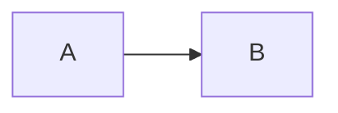

# 博客写作与渲染标准（Jekyll / Hux 风格）

> 目标：保证文章结构稳定、目录可用、Mermaid/图片/段落统一，并可被自动检查。

## 1. Front Matter 标准

### 1.1 必填字段

```yaml
---
title: ""
layout: post
author: "Peter Lau"
published: true
categories:
  - AI
tags:
  - AI
---
```

### 1.2 推荐字段

```yaml
subtitle: ""
header-style: text
toc: true
toc_sticky: true
```

### 1.3 文件命名

- 路径：`_posts/<category>/YYYY-MM-DD-slug.md`
- `slug` 使用英文小写 + 连字符（`-`）

---

## 2. 标题与段落规范

- 正文从 `# 一级标题` 开始（每篇仅一个主标题）。
- 标题层级按顺序递进（`#` -> `##` -> `###`）。
- 段落建议 2~6 行，避免超长大段。
- 中英文混排建议在中英文/数字之间保留空格。

### 2.1 目录（TOC）稳定性规则（强制）

- 不要在 ` ```markdown ` 代码块中直接写 `#`/`##` 这类标题示例。
- 如必须展示标题示例，使用 ` ```text ` 代码块。
- 避免在代码块前后缺少空行。

> 说明：当前主题的目录脚本会抓取页面中的标题节点；若 markdown 示例被解析成标题，可能导致目录异常膨胀、定位错乱或折叠体验异常。

---

## 3. Mermaid 规范

### 3.1 基本写法

````markdown

````

### 3.2 约束

- Mermaid 代码块前后保留空行。
- 图节点文本尽量简洁，超长文本建议换行或拆图。
- 不在 Mermaid 代码块内混入 Markdown 标题语法。

---

## 4. 图片规范

- 路径统一使用站点绝对路径：`/img/...`
- 推荐目录：`/img/<category>/<post-slug>/...`
- 必填 alt 文本（Markdown 图片语法中）。
- 优先使用 Markdown 语法插图；复杂排版可用 `<figure>`。

示例：

```markdown

```

---

## 5. 提交前检查要求

- `npm run lint` 必须通过。
- `npm run lint:posts` 必须通过（含 Front Matter、标题、图片与 fenced-markdown 标题检查）。
- 任何失败项必须修复后再提交。