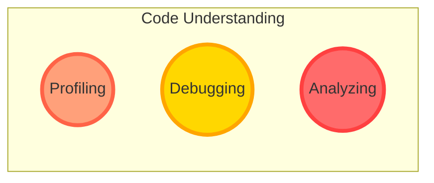

<figure style="text-align: center">
    
    <figcaption style="font-style: italic; color: #666;">Cursor AI Code Editor</figcaption>
</figure>

本篇文章会持续更新，记录Cursor的实践总结。

## 代码生成

工作中经常需要使用脚本处理各种任务，比如日志分析、可视化数据、文本批量修改等。使用Python并借助Cursor的代码生成功能，可以大大提高工作效率。下面贴一张经常使用的Python代码Prompt生成示例。

### Prompt示例

```python
Please write a python script:

Method:
using prefect task flow

Goal: 
Correct the invalid cmake file

Input: 
- Invalid output from the script above
- The C++ standard you want

Output: 
The corrected cmake file path, line and line number in cmake, dump to json file

Steps:
1. Accept the invalid output from the script above and the C++ standard you want, use argparse to accept the arguments
2. Find the invalid cmake file
3. Correct the CXX_STANDARD or CXX_FLAGS to the standard you want, you may need to use pattern matching
4. Collect each modified cmake file path, line and line number in cmake, dump into json file

Requirements:
1. The output json file should follow this format:
    {
        "files": [
            {
                "path": "file1.cmake",
                "line": 10,
                "line_number": 10
            },
            {
                "path": "file2.cmake",
                "line": 20,
                "line_number": 20
            }
        ]
    }

2. Use argparse to accept the arguments
```

拿到对应的结果后，可以不着急使用，建议继续提问：

```python
Given the code to me. Please check:

1. If it is correct and achieves my goal
2. If it is not correct, please correct it and explain to me
3. Be sure to make the code readable, reusable and easy to maintain
```

具体需要多少次提问，可以根据任务的难度来进行调整。如果代码需要实现的任务比较复杂，建议自行拆解任务，分步实现。

## 代码理解



## Composer


[Cursor Composer 使用教程](https://www.youtube.com/watch?v=Tm_2RZm8JB8)

