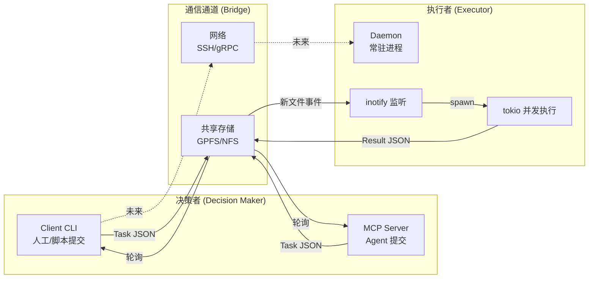
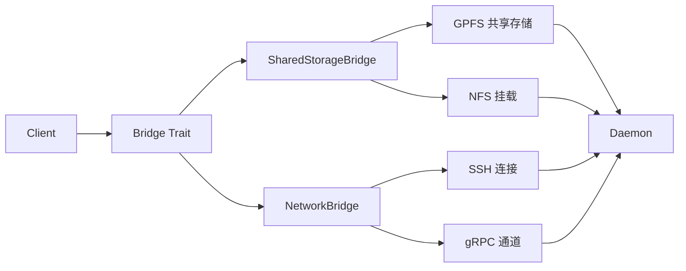

开发 [Bifrost](https://github.com/peterlau123/Bifrost) 时，我意识到它的设计哲学和 Agent 架构惊人地相似——**决策者与执行者的分离**。

## Agent 架构的核心模式

现代 LLM Agent 的工作方式可以概括为：

```
LLM 输出意图 → Agent 调用工具 → 执行 → 返回结果
```

这里有两个关键角色：
- **决策者（LLM）**：只管"做什么"，输出意图
- **执行者（Agent）**：只管"怎么做"，调用工具完成

双方通过消息传递解耦，各司其职。

## Bifrost：同样的分离思想

Bifrost 解决的是离线机器（air-gapped）的命令执行问题。传统方案如 SSH、RPC 都依赖网络，离线场景无法使用。

解决方案：**把决策者和执行者拆成两个独立进程**。

### 架构图



| 角色 | Agent 架构 | Bifrost 架构 |
|------|-----------|--------------|
| 决策者 | LLM 输出意图 | Client 提交任务 JSON |
| 执行者 | Agent 调用工具 | Daemon 执行 shell 命令 |
| 通信 | 消息队列 / 函数调用 | 共享存储 / 网络通道 |

决策者不必等待执行完成，提交后即可离开；执行者常驻运行，随时接收新任务。这种异步模型在 Agent 和 Bifrost 中是相通的。

## 为什么选择 Rust

- **无运行时依赖**：单一二进制，部署到离线机器无需安装任何环境
- **性能与安全兼顾**：tokio 异步运行时，零成本抽象；所有权系统避免内存问题
- **适合常驻进程**：内存占用稳定，长时间运行无 GC 停顿

### Task 模型

任务通过 JSON 文件在共享存储中传递，结构如下：

```rust
/// Task definition - represents a single command execution task
#[derive(Serialize, Deserialize, Debug, Clone)]
pub struct Task {
    pub task_id: Uuid,
    pub timestamp: DateTime<Utc>,
    pub command: String,
    pub task_type: TaskType,     // Shell / Pytest / Custom
    pub priority: u8,            // 0-255, lower = higher priority
    pub timeout: u64,            // seconds
    pub retry_count: u8,
    pub working_dir: PathBuf,
    pub artifacts_expected: Vec<String>,
}

#[derive(Serialize, Deserialize, Debug, Clone)]
pub struct TaskResult {
    pub task_id: Uuid,
    pub status: TaskStatus,      // Pending / Running / Completed / Failed / Timeout
    pub output: TaskOutput,      // stdout, stderr, exit_code
    pub start_time: DateTime<Utc>,
    pub end_time: DateTime<Utc>,
    pub duration_ms: i64,
}
```

Client 写入 `commands/{task_id}.json`，Daemon 执行后写入 `results/{task_id}_result.json`。

## 任务并发如何实现

Daemon 端使用 tokio 异步运行时，通过 `max_concurrent` 控制并发数（默认 10）。

### Executor 核心逻辑

```rust
pub struct Executor {
    log_manager: LogManager,
    default_timeout: Duration,
}

impl Executor {
    /// Execute a task and return the result
    pub async fn execute(&self, task: &Task) -> Result<TaskResult, String> {
        let start_time = Utc::now();
        let task_timeout = Duration::from_secs(task.timeout);

        // execute_command 内部处理超时并 kill 整个进程组
        let execution_result = self.execute_command(task, task_timeout).await;

        let end_time = Utc::now();

        match execution_result {
            Ok(output) => {
                // 写入日志
                self.log_manager.write_stdout(task.task_id, &output.stdout)?;
                self.log_manager.write_stderr(task.task_id, &output.stderr)?;

                let status = if output.exit_code == Some(0) {
                    TaskStatus::Completed
                } else {
                    TaskStatus::Failed
                };

                Ok(TaskResult {
                    task_id: task.task_id,
                    status,
                    output,
                    start_time,
                    end_time,
                    duration_ms: (end_time - start_time).num_milliseconds(),
                    ..
                })
            }
            Err(e) => {
                // 超时或执行失败
                let timed_out = e.contains("Task timed out");
                Ok(TaskResult {
                    status: if timed_out { TaskStatus::Timeout } else { TaskStatus::Failed },
                    ..
                })
            }
        }
    }
}
```

### 并发执行流程

```
                ┌─────────────────┐
                │   inotify 监听   │
                │  commands/ 目录  │
                └────────┬────────┘
                         │ 新文件事件
                         ▼
                ┌─────────────────┐
                │   读取 Task JSON │
                └────────┬────────┘
                         │
                         ▼
            ┌────────────────────────┐
            │  tokio::spawn(async {  │
            │    executor.execute()  │
            │  })                    │
            └────────────┬───────────┘
                         │ 并发执行 (max_concurrent)
                         ▼
                ┌─────────────────┐
                │ 写入 Result JSON │
                │  results/ 目录   │
                └─────────────────┘
```

inotify 实时感知新任务（fallback 100ms 轮询兜底），每个任务通过 `tokio::spawn` 异步执行，互不阻塞。

## 通信通道：共享存储与网络

Bifrost 的 Bridge 抽象使通信介质可替换：

```rust
/// Bridge trait - 抽象通信通道
pub trait Bridge: Send + Sync {
    /// 提交任务到执行队列
    fn submit(&self, task: &Task) -> Result<()>;
    
    /// 查询任务执行结果
    fn retrieve(&self, task_id: &str) -> Result<TaskResult>;
    
    /// 检查执行者健康状态
    fn health_check(&self) -> Result<HeartbeatInfo>;
}
```

### 当前实现

| Bridge | 通信介质 | 适用场景 |
|--------|---------|---------|
| `SharedStorageBridge` | GPFS / NFS / Lustre | 离线机器（air-gapped） |
| `NetworkBridge` *(规划中)* | SSH / gRPC | 在线机器 |



决策者和执行者的通信，本质上就是个消息传递问题——共享存储只是其中一种实现。

## 与 Pi-to-Pi 的联系

[Pi-to-Pi](https://www.youtube.com/watch?v=PIdETjcXNIk) 描述的是两个 Agent 之间的协作编排：一个 Agent 负责规划，另一个 Agent 负责执行。这种"决策者-执行者"的双向通信模式，与 Bifrost 的 Client-Daemon 关系如出一辙。

| 模式 | 决策者 | 执行者 | 通信方式 |
|------|-------|-------|---------|
| Agent | LLM | Agent 工具调用 | 内存 / 消息队列 |
| Bifrost | Client CLI | Daemon 进程 | 共享存储 / 网络 |
| Pi-to-Pi | Agent A | Agent B | 双向通道 |

本质相同：**将"想做什么"和"怎么去做"分离，通过通道解耦**。

## 应用场景

- **离线机器测试**：在 GPU 服务器上执行 pytest，结果通过共享存储取回
- **构建任务**：提交编译任务，异步执行，不阻塞本地工作
- **数据处理**：离线环境处理敏感数据，产物通过共享存储同步
- **Agent 集成**：内置 MCP Server，任意 Agent（Hermes/Claude Code/OpenCode）可直接提交任务

## 小结

Bifrost 借鉴了 Agent 架构的核心思想——**决策者与执行者分离**，只是决策者从 LLM 换成了人/脚本。这种分离带来的好处是通用的：

1. **异步**：提交即返回，不阻塞决策者
2. **解耦**：双方独立演进，通过通道通信
3. **可观测**：任务状态、日志、产物全程可追溯

当你下次设计一个"提交-执行-取回"的系统时，不妨想想 Agent：是不是也在做同样的事情？