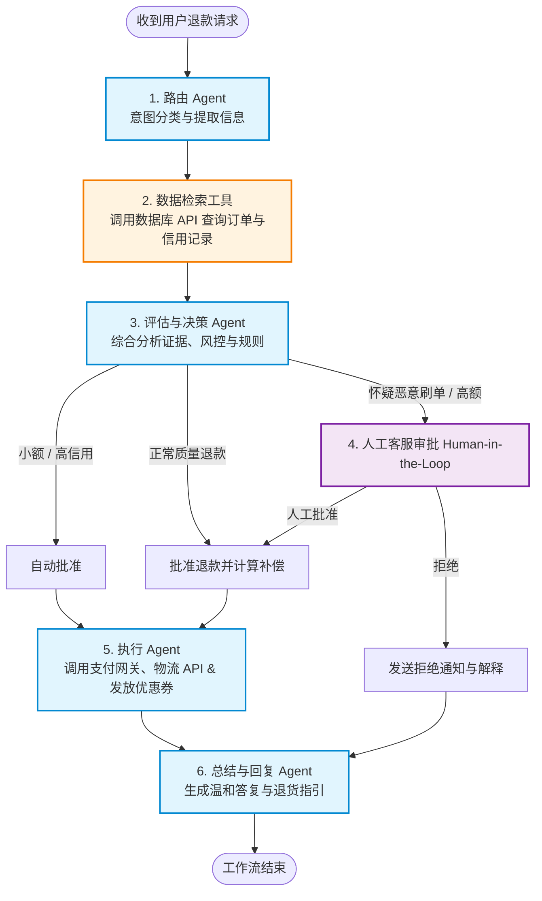

Workflow 并不是一个新概念。在 LLM 之前，workflow 就作为一种程序编排范式存在于现实业务中，典型代表是 Taskflow[^1] 和 Workflow[^2]。它们都以 **Task** 为基本单位，通过定义任务之间的依赖关系来实现复杂的业务流程。

LLM 时代的 workflow，按照 LangChain[^3] 的定义，是沿着预定的代码路径，按照固定的顺序执行，只不过路径节点是 LLM，参考图示例如下：

<div style="text-align: center;">

</div>

上图展示了通过 prompt chaining/parallelization/routing/evaluator-optimizer 等形式将 LLM 节点组织起来。这里的 LLM 节点内部其实就是 LLM API call。

## What Is an Agent Workflow?

那什么是 Agent Workflow？

目前没有统一的定义，但比较确定的是它也有预定的执行路线，只不过这里的节点从 LLM 切换为了 Agent。Agent 相比 LLM 多了 execution，memory 和 tool call 等能力。

我们来看一个典型的 Agent Workflow，工作流程如下：



从上图可以看到，Agent Workflow 从入口至结束，虽然有分支，但是执行路径比较清晰，Agent 节点做智能分析路由。

我们也时常听到 Agentic Workflow[^4]，它和 Agent Workflow 的主要区别如下：

| Area | Non-agentic Workflow | Agentic Workflow |
|------|----------------------|------------------|
| Decision-making | Hardcoded rules and conditions | AI-driven evaluation at decision nodes |
| Adaptability | Static, breaks on edge cases | Adapts to unexpected inputs in real time |
| Traceability | Full, deterministic logs | Step-wise visibility with AI reasoning traces |
| Best suited for | Repetitive, predictable tasks | Complex, multi-step tasks requiring judgment |

前者强调 Agent 自主能力，后者强调 Agent 沿着既定的路线。我们看一个 Agentic Workflow 的例子如下：

```mermaid
flowchart TD
    Start([用户输入：撰写 Rust 技术博客]) --> Planning[1. 规划节点 Planning Agent<br/>拆解大纲与结构]
    Planning --> Research[2. 执行与检索 Research & Drafting Agent<br/>调用搜索引擎获取最新语法，撰写初稿]
    
    Research --> CodeExec[3. 代码验证节点 Code Execution Tool<br/>将代码提取并送入沙盒编译]
    
    CodeExec -->|编译报错| Research
    CodeExec -->|编译通过| Review[4. 反思与评审节点 Reviewer / Evaluator Agent<br/>审阅逻辑、准确性与技术幻觉]
    
    Review -->|发现问题 / 需重写| Research
    Review -->|评估通过 Pass| End([5. 输出最终高质量终稿])

    classDef agent fill:#e1f5fe,stroke:#0288d1,stroke-width:2px;
    classDef tool fill:#fff3e0,stroke:#f57c00,stroke-width:2px;
    classDef process fill:#e8f5e9,stroke:#388e3c,stroke-width:2px;
    
    class Planning,Research,Review agent;
    class CodeExec tool;
    class Start,End process;
  ```

从上面的执行过程可以看到，Agentic Workflow 通过 AI 驱动的决策节点，会有典型的自我纠错和迭代的行为。

## Why Use Agent Workflow?

当前 LLM 的发布频率以周计，各家厂商的模型在 Benchmark 上的得分越来越高，完成复杂任务的能力也越来越强。于是乎，不少人可能会有疑问，既然大模型这么强大，为何还要拟定 Agent Workflow 呢？让 Agent 端到端完成任务不就可以了么？Workflow 还有存在的必要么？

要回答这个问题，不能简单只看大模型在评测时展现的强不强。

如果要把 Agent 部署在生产环境中，Agent 自身能力是一方面，我们还要考虑到 Agent 能力是否可被追踪审计，是否高效以及是否稳定。

首先，由于 LLM 固有的概率特征，它无法多次输出同样的内容，这就意味着它在完成任务时走的路径可能前后相异，这就给问题排查加大了难度；其次，Agent 带有反思优化行为，事物都有两面性，智能化的代价就是低效率，你也许会经常发现它在一个问题上反复雕琢停滞不前；最后，Agent 的路径不确定性使得 Agent 独立端到端完成任务充满不确定性，这对于需要稳定交付的商业场景是不被允许的。

Workflow 就不一样，它预先定义执行路径并将目标拆分为多个子任务，每个子任务可以由一个 Agent 负责执行。这样使得每个子任务的输出方便审核，任务之间的切换流转也方便观察追踪，即使任务意外中断，也可以从中断节点恢复任务执行，倘若再对子任务及其输入输出施加更多约束，Workflow 的执行路径就更加稳定可靠。

## When to Use Agent Workflow?

既然 Agent Workflow 的存在有其价值，那么我们来看它适合什么场景。根据 Agent Workflow 的行为特点，我们可以将其应用于需要 **稳定执行路径和可追踪审计** 的场景。

比如上文提到的购物退款工作流、DevOps 的 CI/CD 流水线、安全运维等。

## How to Use Agent Workflow?

Anthropic 的 workflow pattern[^5] 定义了三种形式的 workflow：Sequential、Parallel 和 Evaluator-optimizer。三者的具体形态如下：

<div style="text-align: center;">

</div>

<div style="text-align: center;">

</div>

<div style="text-align: center;">

</div>

实际使用的 workflow 可能是上面三者的混合形式。我在实践中使用最多的是第一种。通常，我将 workflow 拆分为多个 stage，每个 stage 对应一个 skill，每个 skill 由一个 agent 来执行。skill 中包含 skill spec、脚本和参考文档。整体的 stage 顺序预先在 workflow 的 spec 中定义好。这样 Agent 就能沿着既定的路径去执行各个 stage，智能化的完成各个 stage 的子任务。当然，也并不是每个 stage 一定都需要 Agent 来加载 skill 来执行，可以根据 stage 的特点选择通过脚本完成还是引入 Agent 来执行。

我这种使用方式一般也可以称为 **Agent in Workflow**[^6]，也就是在既定的路线上，Agent 适时介入。

## 结语

Agent Workflow 就像是给 Agent 提前约定了执行路线，限制了其自由发挥的能力。这种看似"限制"的做法在生产环境中比较可靠。

Agent 自主能力适合在代码编写、bug 修复和深入调研中使用，因为在那些场景，我们更看重它是否能完成以及完成的结果质量，至于它怎么一步步做出来，我们并不关心。

## 参考资料

[^1]: [Taskflow - A General-purpose Parallel and Heterogeneous Task Programming System](https://github.com/taskflow/taskflow)
[^2]: [Workflow - C++ Parallel Computing and Asynchronous Networking Engine](https://github.com/sogou/workflow)
[^3]: [LangChain Docs](https://docs.langchain.com/oss/python/langgraph/workflows-agents)
[^4]: [Agentic Workflows](https://mastra.ai/articles/agentic-workflows)
[^5]: [common workflow patterns for AI agents and when to use them](https://claude.com/blog/common-workflow-patterns-for-ai-agents-and-when-to-use-them)
[^6]: [agents vs workflows](https://huggingface.co/blog/VirtualOasis/agents-vs-workflows-en)
