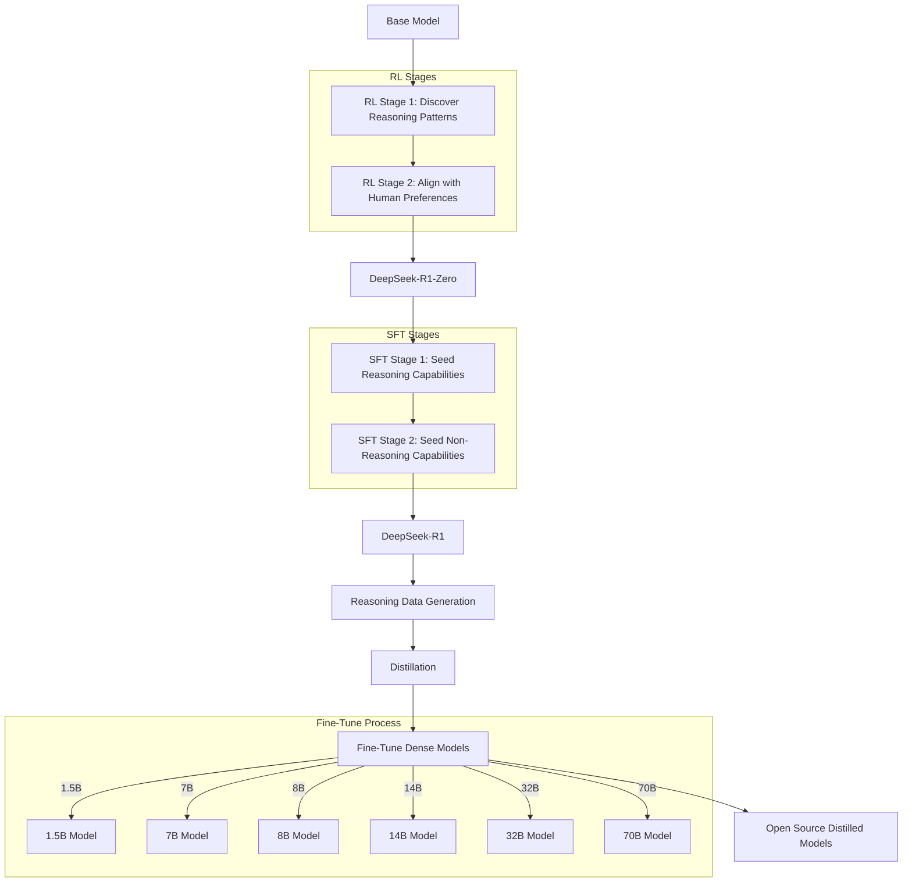

## R1生产流程

```mermaid
graph TD;
    A[Base Model] --> B[RL Stage 1: Discover Reasoning Patterns]
    B --> C[RL Stage 2: Align with Human Preferences]
    C --> D[DeepSeek-R1-Zero]
    D --> E[SFT Stage 1: Seed Reasoning Capabilities]
    E --> F[SFT Stage 2: Seed Non-Reasoning Capabilities]
    F --> G[DeepSeek-R1]
    G --> H[Reasoning Data Generation]
    H --> I[Distillation]
    I --> J[Fine-Tune Dense Models]
    J --> K[Open Source Distilled Models]

    subgraph RL Stages
        B
        C
    end

    subgraph SFT Stages
        E
        F
    end

    subgraph Fine-Tune Process
        J --> |1.5B| J1[1.5B Model]
        J --> |7B| J2[7B Model]
        J --> |8B| J3[8B Model]
        J --> |14B| J4[14B Model]
        J --> |32B| J5[32B Model]
        J --> |70B| J6[70B Model]
    end
```

## 模型结构