[TOC]

**本文总结自[learn-harness-engineering](https://github.com/walkinglabs/learn-harness-engineering)**

🙋‍♂️为个人理解部分

# 模型能力强不等于执行可靠

Anthropic 做过一个对照实验。同一个 prompt（"做一个 2D 复古游戏编辑器"），同一个模型（Opus 4.5）。第一次让它裸跑——20 分钟，花了 $9，游戏核心功能根本跑不起来。第二次给它配上完整的 harness（planner + generator + evaluator 三 agent 架构）——6 小时，花了 $200，游戏可以正常游玩。

模型没换。Opus 4.5 还是那个 Opus 4.5。换的是马鞍。

OpenAI 在 2025 年发布的 harness engineering 文章里说得更直白：Codex 在一个 harness 搭得好的仓库里，表现能从"不可靠"变成"可靠"。注意他们的用词——不是"好了一点"，是质变。就像一匹千里马，没马鞍你也能骑，但骑不了多远、跑不了多快、摔下来也不稀奇。harness 就是那个马鞍——<font color=red>**模型权重之外的一切工程基础设施**</font>。


核心原则：**遇到失败，先别换模型，先检查 harness。** 如果同一个模型在类似的结构良好的任务中能成功，那优先假设是 harness 的问题。这就像汽车抛锚——你不会第一时间怀疑是发动机坏了，你会先看看是不是没油了。

具体怎么做：

**每次失败都归因到具体层。** 不要笼统地说"模型不行"，而是问：是任务没说清楚？是上下文不够？是没有验证手段？把每次失败归到上面五层中的某一层。养成这个习惯，你会发现"模型不行"这个结论在你的日志里出现得越来越少。

**给每个任务写显式的完成定义。** 不要说"加个搜索功能"，要说：

```
完成标准：
- 新增 GET /api/search?q=xxx 端点
- 支持分页，默认 20 条
- 返回结果包含高亮片段
- 所有新代码通过 pytest
- 类型检查通过（mypy --strict）
```

**创建 AGENTS.md 文件。** 在仓库根目录放一个文件，告诉 agent 这个项目的**技术栈、架构约定、验证命令**。这是 harness 工程的第一步，也是投入产出比最高的一步。一个 `AGENTS.md` 文件可能比你换一个更贵的模型更有效——我不是在开玩笑。

**建立诊断循环。** 不要把失败当作"模型又犯傻了"，而是当作"harness 又暴露了一个缺陷"的信号。每次失败 → 定位层 → 修补 → 下次不再犯。几轮下来，你的 harness 会越来越强，agent 的表现会稳定提升。就像修路——每填一个坑，下一段路就更平坦。

**量化改进。** 记个简单的日志：每个任务成功了没有，失败了是哪一层的问题。跑几轮之后你就能看出来哪个层是瓶颈，集中火力修那个层。


# 什么是Harness

模型权重之外的一切基础设施

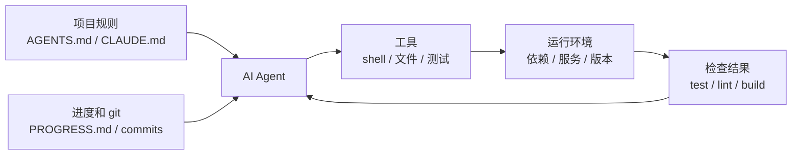

Harness不是简单的prompt文件，它由五大部分组成，如上图所示。


**指令子系统（菜谱架）**：创建 `AGENTS.md`（或 `CLAUDE.md`），内容包括项目概览和目的（一句话说清楚这是什么）、技术栈和版本（Python 3.11、FastAPI 0.100+、PostgreSQL 15）、首次运行命令（`make setup`、`make test`）、不可违反的硬约束（"所有 API 必须走 OAuth 2.0"）、指向更详细文档的链接。

**工具子系统（刀具架）**：确保 agent 有足够的工具访问权限。不要因为"安全考虑"把 shell 给禁了——agent 连 `pip install` 都跑不了，还怎么干活？但也别什么都开放，按最小权限原则来。

🙋‍♂️MCP server和skills属于这一类子系统

**环境子系统（灶台）**：让环境状态自描述。用 `pyproject.toml` 或 `package.json` 锁定依赖，用 `.nvmrc` 或 `.python-version` 指定运行时版本，用 Docker 或 devcontainer 让环境可重现。

**状态子系统（备菜台）**：长任务必须有进度跟踪。用一个简单的 `PROGRESS.md` 文件记录：哪些做完了，哪些在做，哪些被阻塞。每个会话结束前更新，下一个会话开始时读取。

**反馈子系统（出菜检查口）**：这是投入产出比最高的子系统。在 `AGENTS.md` 里显式列出验证命令：

```markdown
验证命令：
- 测试：pytest tests/ -x
- 类型检查：mypy src/ --strict
- Lint：ruff check src/
- 完整验证：make check（包含以上全部）
```


# 把你的仓库变为唯一的信息源头

> OpenAI states this bluntly: **information that doesn't exist in the repo, doesn't exist for the agent.** They call this the "repo as spec" principle — the repository itself is the highest-authority specification document.

按照OpenAI的说法，你的仓库要包含Agent需要的所有信息，没有额外的必需信息散落在仓库以外。参考下图


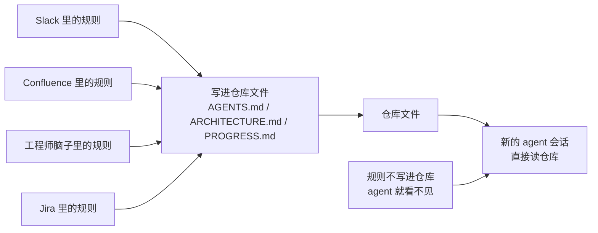


🙋‍♂️将仓库本身作为Agent的导航地图

## 什么是好的导航地图

<font color=red>以下五个问题，可以用来判断当前的仓库信息是否足够，是否可以给agent一个好的导航</font>

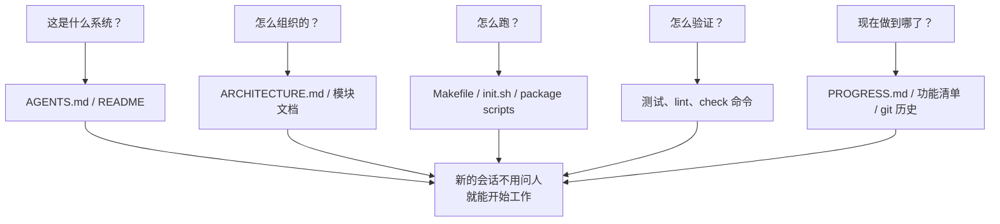


遵循下叙4个准则：

+ 准则一：指示要在代码附近。

例如关于API端点认证的规则说明就放在API代码旁边，不要放在一个巨型的文档目录中。这样Agent在理解这部分代码时，就不用去海量的文档中去翻阅，而是就近阅读说明文档。

+ 准则二：使用标准的入口文件。

AGENTS.md（或者CLAUDE.md）是agent的导引文档。它不必包含所有的信息，但是必须能够让Agent回答“这个project是做什么的”，“我怎么安装和运行它”和“我怎么做验证”等问题。

+ 准则三：小而完备。

每条信息（或规则）有一个明确的用途即可，不需要包罗万象，而且移除它后会影响Agent的理解和判断。

+ 准则四：文档要跟随代码随时更新。

将模块文档（例如架构设计说明）放到每个模块的目录下。当模块发生变更，使用CI提醒是否要做文档变更。

根据上述规则，好的仓库目录结构大致如下

```
project/
├── AGENTS.md              # 入口：项目概览、运行命令、硬约束
├── src/
│   ├── api/
│   │   ├── ARCHITECTURE.md  # API 层的架构决策
│   │   └── ...
│   ├── db/
│   │   ├── CONSTRAINTS.md   # 数据库操作的硬约束
│   │   └── ...
│   └── ...
├── PROGRESS.md             # 当前进度：做了什么、在做什么、被什么阻塞
└── Makefile                # 标准化的操作命令：setup、test、lint、check
```


## Agent state管理原则

遵循ACID处理原则

**atomicity**

Agent的每个操作只准提交一个commit，这是为了失败方便进行回滚。

**consistency**

Agent每次操作后都可以进行验证，中间状态不会被提交。

**isolation**

多个agent协同时，不可以存在竞争。简单的方法是每个agent使用自己的PROGRESS.md或者各自拥有提交分支。

**durability**

关键的仓库知识如AGENTS.md必须要提交，临时的Agent状态信息可以存在会话存储区，但是跨会话的知识必须持久化至本地文件中。


# 如何应对爆炸增长的Agent instruction

## 问题背景

你创建了一个AGENTS.md，在其中添加规则、限制以及你学习到的经验和教训。随着时间积累，规则、限制和经验会变得越来越多，使得AGENTS.md文件变得也越来越大。同时，你也会注意到，你的Agent并没有严格遵循你的每项指令或约束，上下文的Token消耗却越来越多。

这是为何？

随着指令文件（也就是上文提到的AGENTS.md或者其他说明文档）变大，上下文长度首先被指令文件的Token占用，其次才会腾出空间放源代码，而留给代码的Token额度越来越小。

同时，指令文件虽然在增长，表面上我们给Agent越来越多的有用信息，但是Agent实际在理解时，会更加注重首尾的信息，忽视中间信息（参考论文[Lost in the middle](https://arxiv.org/pdf/2307.03172)）。参考下图所示

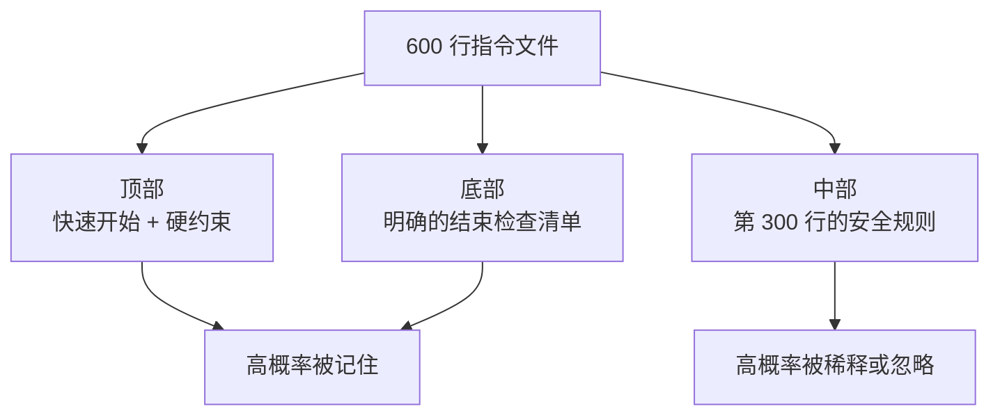


另外，指令文件中的规则优先级是不一样的，如果一股脑都放在里面，不分顺序。Agent可能自身是无法分清楚相对优先级，这样在遵循指令的时候，可能不会那么准确。如同软件开发中的技术债一样，指令文件中不断增长的指令维护成本也会上升，久远的指令有时可能很难说清楚清理掉会带来什么影响，也可能使得前后增加的指令约束存在南辕北辙的情况。

## 如何解决

```markdown
# AGENTS.md

## Project Overview
Python 3.11 FastAPI backend, PostgreSQL 15 database.

## Quick Start
- Install: `make setup`
- Test: `make test`
- Full verification: `make check`

## Hard Constraints
- All APIs must use OAuth 2.0 authentication
- All database queries must use SQLAlchemy 2.0 syntax
- All PRs must pass pytest + mypy --strict + ruff check

## Topic Docs
- [API Design Patterns](docs/api-patterns.md) — Required reading when adding endpoints
- [Database Rules](docs/database-rules.md) — Required when modifying database operations
- [Testing Standards](docs/testing-standards.md) — Reference when writing tests
```


参考上图，将指令文件进行拆分。经常使用和必备的指令如**Quick Start**和**Hard Constraints**放在开头，专项的指令按照**Topic Docs**组织，由Agent来进行按需加载。文件中间尽量避免存放过多指令约束。OpenAI认为指引文件应该**short and routing-oriented**。

# 如何跨会话保持上下文

## 问题背景

当你的目前会话运行比较久比如30分钟，你的上下文长度很可能会被用尽了。此时，你会新开一个会话，但是目前Agent忘记了你在上个会话做出的抉择。例如哪些文件已经被修改，已经做过哪些测试，目前处在什么状态等等。这个问题之所以产生是因为上下文长度是有限的，早晚都会有用尽的时候，即使上下文长度达到千百万级，仍有可能会用尽。

在这个过程中代码库的理解，历史对话和工具调用结果处理都占用Token额度。这些信息的重要性不是一致的。上下文中，如何做抉择的信息往往比工具调用结果信息更重要。如果当前会话只看到上一个会话的输出，但是看不到**why**，那么Agent可能无法很好的遵循以往的设计和优化策略。

更加令人意想不到的是，Anthropic发现当上下文长度即将被用尽时，Agent会呈现出**premature convergence**，类似在截止期限前匆忙赶工完成，跳过验证步骤或者选择一个简单方法完成了事。

下图演示了刚才提到的问题

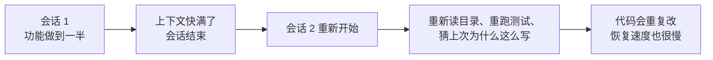

## 如何解决

我们把Agent当作一位具有阿兹海默症的匠人，也即是说它随时可能忘记之前工作做了啥。那么为了避免忘记，我们引入**日志记录工作进展**。

第一个工具是定期记录PROGRESS.md，参考例子如下

```markdown
# Project Progress

## Current State
- Latest commit: abc1234 (feat: add user preferences endpoint)
- Test status: 42/43 passing (test_pagination_edge_case failing)
- Lint: passing

## Completed
- [x] User model and database migration
- [x] Basic CRUD endpoints
- [x] Auth middleware integration

## In Progress
- [ ] Pagination feature (90% - edge case test failing)

## Known Issues
- test_pagination_edge_case returns 500 on empty result sets
- Need to confirm whether deleted users should appear in listings

## Next Steps
1. Fix pagination edge case bug
2. Add "include deleted users" query parameter
3. Update API documentation
```

第二个工具是DECISION.md，参考例子如下

```markdown
# Design Decisions

## 2024-01-15: Use Redis for user preferences caching
- Reason: High read frequency (every API call), small data size
- Rejected alternative: PostgreSQL materialized view (high change frequency makes maintenance cost not worthwhile)
- Constraint: Cache TTL of 5 minutes, active invalidation on write
```

第三个工具是git，提交信息应该清楚的解释**what**和**why**。

🙋‍♂️可以规范化git commit mesage提交格式

第四个工具是**init.sh**和**harness initialization flow**，明确session的开始和结束前要做啥，参考例子如下

```markdown
## At session start (clock in)
1. Read PROGRESS.md for current state
2. Read DECISIONS.md for important decisions
3. Run make check to confirm repo is in consistent state
4. Continue from PROGRESS.md "Next Steps" section

## Before session end (clock out)
1. Update PROGRESS.md
2. Run make check to confirm consistent state
3. Commit all completed work
```

# 请在会话前做好初始化

俗话说“磨刀不误砍柴工”，在实际干活前做好准备工作，可以避免在实际操作中仍需花时间做无关的辅助工作。试想你向Agent发送任务添加新功能，但是工作中Agent发现测试框架还不可用，工具脚本还存在错误等问题，它需要先花时间处理这些问题再去添加功能。

初始化的目标是保证后续实现的效率和可靠，实现的目标是保证可验证功能的质量和数量。显然，两者的目标不一样，如果Agent同时做初始化和实现，他可能顾此失彼，两者都不能完成的很好。

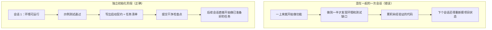

Anthropic的长运行应用开发研究数据表明：在多轮会话中，细致初始化的项目会比不做细致初始化的项目高31%的功能完成度。初始化阶段的时间投入会在后续3~4轮的会话中回本。基础越好，墙垒的越快（项目完成越快）。

🙋‍♂️可以选用廉价的模型做好基础的准备工作，再正式使用昂贵的模型进行不复杂项目开发

---

第一次会话尽量只做初始化相关的工作，不着急添加业务功能。初始化会有如下输出：

**可运行的环境**

依赖完备，没有环境问题

**可验证的框架**

测试框架需要搭建完成

**契约文件**

```markdown
# Initialization Contract

## Start Commands
- Install dependencies: `make setup`
- Start dev server: `make dev`
- Run tests: `make test`
- Full verification: `make check`

## Current State
- All dependencies installed and locked
- Test framework configured (Vitest + React Testing Library)
- Example test passing (1/1)
- Lint rules configured (ESLint + Prettier)

## Project Structure
- src/ — Source code
- src/components/ — React components
- src/api/ — API client
- tests/ — Test files
```

**任务拆解**

```
# Task Breakdown

## Task 1: User Authentication Basics
- Implement JWT auth middleware
- Add login/register endpoints
- Acceptance: pytest tests/test_auth.py all passing

## Task 2: User Profile Page
- Implement user profile CRUD
- Add profile edit form
- Acceptance: pytest tests/test_profile.py all passing

## Task 3: Search Feature
- ...
```

**git**

完成初始化的提交，所有后续任务从此提交开始

---


当然为了避免冗长繁复的初始化工作，可以直接使用一些通用的项目模板如python/C++项目模板（参考[rochacbruno/python-project-template]([rochacbruno/python-project-template: This template is **archived**. > UV can now [generate a sample project](https://docs.astral.sh/uv/guides/projects/#creating-a-new-project) > I recommend using **UV** to bootstrap your peojects. > [Copier](https://github.com/copier-org/copier) is a tools that can bootstrap projects from templates.](https://github.com/rochacbruno/python-project-template))），只需要再添加项目相关的文件。


可根据如下检查清单确认初始化完成

```markdown
## Initialization Acceptance Checklist
- [ ] `make setup` succeeds from scratch
- [ ] `make test` has at least one passing test
- [ ] A new agent session can answer "how to run" and "how to test" from repo contents alone
- [ ] Task breakdown file exists with at least 3 tasks
- [ ] Everything committed to git
```

# 设定清晰的任务边界

Agents天生倾向于“do a little extra”。Anthropic在其博客《Effective harnesses for long-running agents》中声称，如果给予Agent过于宽泛的提示词，Agent倾向于做多件事，即使某些任务跟当前目标任务关联度不大。

这里其实就是指如果任务不够聚焦，Agent的精力就会分散，以至于不能够很好完成甚至不能完成。假设上下文长度为C，任务数量为N，平均每个任务分配到的上下文长度为C/N。一旦分配到的上下文长度低于某个阈值，就不足以达到完成任务的目的。如下图所示

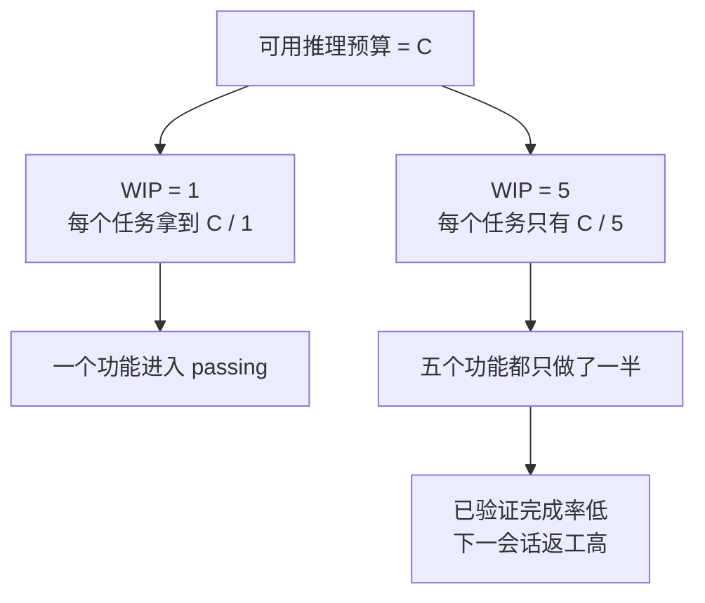

以“add user registration”为例，claude code可能会做如下事：

+ Create a User model

+ Write the registration route

+ Notice it needs email verification, so add a mail service

+ See that passwords need hashing, so bring in bcrypt

+ *Notice the error handling is inconsistent, so refactor the global error middleware*

+ *See the test file structure is messy, so reorganize the directory*

由此你看，Claude并不是至始至终都在聚焦主任务，还会做些相关但非必要的任务如上斜体表示。

**Overeach**和**under-finish**是两个相互关联的状态，一旦Agent精力分散，就会出现Overreach（也就是做很多任务），但是过于分散会使得每个人物都进入under-finish。

正确的工作流应该如下

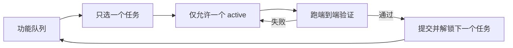

为此，我们可以采取如下策略来使得Agent聚焦：

**强制WIP=1**

WIP是**Work-in-Progress Limit**

在CLAUDE.md或者AGENTS.md中添加如下约束

```markdown
## Work Rules
- Work on one feature at a time
- Only start the next feature after the current one passes end-to-end verification
- Don't "also refactor" feature B while implementing feature A
```

**每个人物定义清晰的完成标识**

```markdown
F01: User Registration
  Verification: curl -X POST /api/register -d '{"email":"test@example.com","password":"123456"}' | jq .status == 201
  State: passing
```

**记录任务状态**

使用Json或者markdown文件记录所有的任务状态。任何会话读取该文件，就能知道哪个任务目前处于活跃状态、什么标志做完了以及目前通过了那些验证。

**监控验收完成率**
$$
VCR=\frac{verified\quad tasks}{active\quad tasks}
$$
如果VCR<1.0，那么表明同时有多个活跃单位完成的任务，那么需要禁止一些活跃任务，保证每次只有一个活跃任务。

# 使用功能列表限制Agent做什么

Agent并不清楚完成一个功能需要做些什么，也许它只认为完成代码编写即完成。

Claude Code 和 Codex 都不会自动知道你心目中的"做完"是什么意思。你说"加一个购物车功能"，模型的理解可能是"写一个 Cart 组件和 addToCart 方法"。而你的意思是"用户能从浏览商品到下单支付完整走通"。

这个理解鸿沟在没有功能清单的情况下会持续存在。agent 用自己的隐式标准判断完成——通常是"代码没有明显的语法错误"。而你需要的是端到端的行为验证。就像你让朋友帮你买菜，说"买点水果"，他拎了一袋柠檬回来——他要的水果，你要的水果，不是一个水果。

正确的功能完成需要满足三项条件：行为正确，验证通过，状态passing

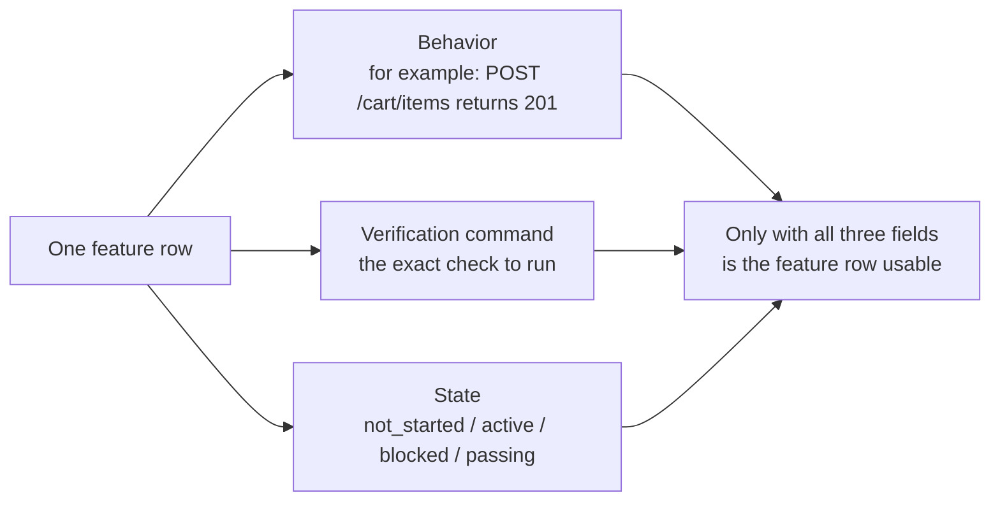

在Harness中，Agent按照如下流程去完成功能

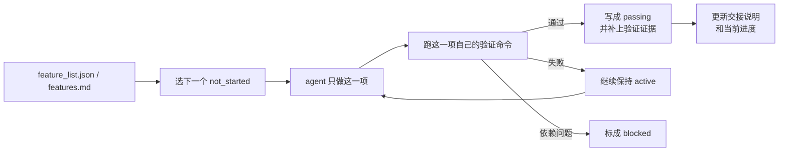


具体实施策略如下：

**定义清晰的功能清单格式**

每个功能清单格式，参考如下

```json
{
  "id": "F03",
  "behavior": "POST /cart/items with {product_id, quantity} returns 201",
  "verification": "curl -X POST http://localhost:3000/api/cart/items -H 'Content-Type: application/json' -d '{\"product_id\":1,\"quantity\":2}' | jq .status == 201",
  "state": "passing",
  "evidence": "commit abc123, test output log"
}
```

**Harness控制功能状态转换**

Agent不能独自更改功能状态，他必须发出验证请求，待验证通过后才能由Harness将状态改为passing

**将功能列表规则写入CLAUDE.md**

```markdown
## Feature List Rules
- Feature list file: /docs/features.md
- Only one feature active at a time
- Verification command must pass before marking as passing
- Don't modify feature list states yourself — the verification script updates them automatically
```

**控制功能粒度**

确保功能在一次会话即可完成，不能过大或过小。

# 防止Agent提前宣告完成

Agent总是倾向于给与自己正向评价，这样会出现明明没有完成所有验证却声称自己做完了，然而实际使用并不能正常工作。如下图所示

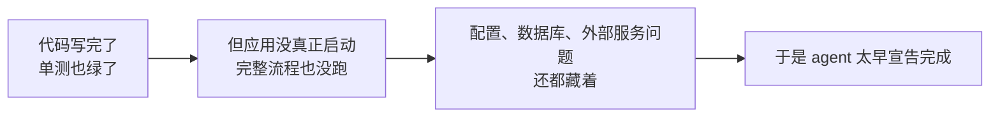

实际上我们需要Agent完成所有验证步骤

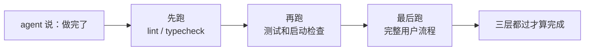

为此，需要引入独立的评价Agent，对完成结果进行评估。

**独立的外部评价**

```markdown
## 完成定义
- 功能完成 = 端到端验证通过，不是"代码写完了"
- 必须运行的验证层级:
  1. 单元测试通过
  2. 集成测试通过
  3. 端到端流程验证通过
- 在第 1 层没通过时，不许进入第 2 层
- 在第 2 层没通过时，不许进入第 3 层
```

**构建三层校验**

+ 语法与静态分析

+ 运行时验证

+ 系统级验证

  端到端、集成和用户使用模拟

**为agent提供“红笔批注”**

给agent设计带修复方法的错误信息，往往比单纯的错误信息更有助于问题解决

**捕获运行时信号**

应用是否成功启动，关键路径是否执行成功

运行时日志可以提供这些信息

# 跑通完整流程才算验证完成

🙋‍♂️可以同上一节合并在一起

单元测试没问题不能代表应用可正常运行，单元测试是基本的模块单元测试，它不包含跨模块交互。因此，系统级别的验证无法通过单元测试来完成。

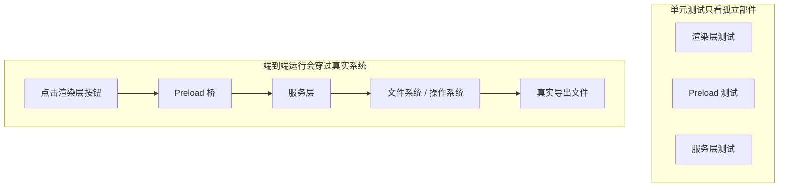

为了执行完整的验证流程：

**先定好架构边界，再写端到端测试**

端到端测试的前提是系统有清晰的边界。如果架构是一团面条，端到端测试只会证明"这团面条整体能跑"，不会告诉你哪里违反了设计意图。就像合唱团如果连分声部都没分好，排练再多也是乱唱。

OpenAI 的经验：**对 agent 生成的代码库，架构约束必须是第一天就建立的早期前置条件，不是等团队规模大了再考虑的事。** 原因很直接——agent 会复制仓库中已有的模式，即使那些模式是不均匀的或次优的。没有架构约束，agent 会在每次会话中引入更多偏差。

关键原则：**执行不变量，不微管实现。** 比如要求"数据在边界解析"，但不规定用哪个库。错误消息要包含修复指导——不只是说"违规了"，而是告诉 agent 具体怎么改。

> 来源：[OpenAI: Harness engineering: leveraging Codex in an agent-first world](https://openai.com/index/harness-engineering/)

**harness 必须包含端到端层**

在你的验证流程里明确：对于涉及跨组件修改的任务，端到端测试通过是完成的前置条件：

```markdown
## 验证层级
- 层级 1: 单元测试 (必须通过)
- 层级 2: 集成测试 (必须通过)
- 层级 3: 端到端测试 (涉及跨组件修改时必须通过)
- 跳过任何必须层级的任务 = 未完成
```

**把架构规则变成可执行检查**

每条架构约束都应该有对应的测试或 lint 规则：

```bash
# 检查渲染进程是否直接调用 Node.js API
grep -r "require('fs')" src/renderer/ && exit 1 || echo "OK: no direct fs access in renderer"
```


**设计面向 agent 的错误消息**

失败信息要包含三要素：什么出了问题、为什么、怎么修：

```
ERROR: Found direct import of 'fs' in src/renderer/App.tsx:12
WHY: Renderer process has no access to Node.js APIs for security
FIX: Move file operations to src/preload/file-ops.ts and call via window.api.readFile()
```

**建立审查反馈提升流程**

每次在代码审查中发现新类型的 agent 错误，就把它变成自动化检查。一个月后你的 harness 会比月初强得多。就像合唱团的排练笔记——每次排练发现的问题都记下来，下次排练前先检查这些点。久而久之，常见错误越来越少，音乐越来越和谐。

# 让Agent运行过程可观测

## 问题背景

当 harness 缺乏可观测性时，四类问题系统性出现：

**无法区分"正确"和"看似正确"**：一个函数在代码审查时看起来完全正确——语法对、逻辑通。但运行时因为边界条件处理错误，在特定输入下产生了不正确结果。只有运行时追踪能揭示实际执行路径偏离了预期。就像一个演员排练时台词全对了，但上台演出时灯光一打，表情和走位全都变了——你不看现场是发现不了的。

**评估变成玄学**：没有评分标准和验收条件时，评估者（人或 agent）依赖隐式假设。同一个输出，不同评估者可能给出截然不同的评价。质量评估不可复现。就像体操比赛没有评分标准——这个裁判觉得你的动作优雅，那个裁判觉得你落地不稳，谁说了算？

**重试变成盲猜**：agent 不知道为什么失败时，重试方向是随机的。它可能在错误的方向上反复尝试——修复了不相关的代码路径而忽略真正的故障根源。就像你开车发现车跑偏了，但你没有仪表盘——你猜是轮胎的问题换了轮胎，实际是方向盘的 alignment 出了问题。每次盲重试都消耗 token 和时间。

**会话交接信息断崖**：当未完成的工作移交给下一个会话时，缺乏可观测性意味着新会话必须从零诊断系统状态。Anthropic 的长期运行 agent 观察表明，这种重复诊断可能占会话总时间的 30-50%。就像换班司机上车发现没有交接记录——他得花半小时检查油量、胎压、发动机状态才能出发。


想象一个使用"计划者-生成者-评估者"三角色工作流的 harness，执行"为应用添加暗色模式"任务。

**没有仪表盘**：计划者输出模糊描述。生成者根据模糊描述实现暗色模式，但和计划者的隐式预期不一致。评估者基于自己的隐式标准拒绝，但说不出具体哪里不对——"感觉不太对"。生成者基于模糊拒绝理由盲重试。循环 3-4 次，总耗时约 45 分钟，最终勉强产出。

**有完整仪表盘**：计划者输出冲刺合同——列明要改哪些组件、每个组件的验证标准、排除项（不处理打印样式）。生成者按合同实现。运行时可观测性记录每个组件的样式加载和应用过程。评估者用评分标准逐维度评估，附具体证据引用——"按钮颜色对比度不足（WCAG AA 标准 4.5:1，实测 2.1:1）"。一次迭代出高质量结果，总耗时约 15 分钟。

效率差 3 倍。区别只在可观测性——给车装上了仪表盘。

可观测性不是"多打点日志"那么简单。它分两层，缺一不可：

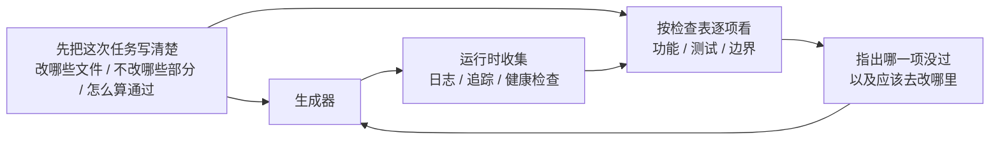

**运行时可观测性**：系统层的信号——日志、追踪、进程事件、健康检查。回答"系统做了什么"。这是你车上的仪表盘——速度、油量、发动机温度。

**过程可观测性**：harness 决策工件的可见性——计划、评分标准、验收条件。回答"为什么这个变更应该被接受"。这是你的导航系统——不光知道现在在哪，还知道为什么走这条路。

你可能在想："agent 不能自己打日志吗？" 问题在于：

1. **agent 不知道它不知道什么**——它不会主动记录自己没意识到需要的信号。就像你不知道油箱快漏了的时候，你不会去看油量表——因为你压根不知道该看。
2. **日志格式不统一**——不同会话用不同的日志格式，无法做系统化分析。就像十个司机各写各的交接记录，格式都不一样，下一个司机看不懂。
3. **过程可观测性不是日志能解决的**——冲刺合同和评分标准是结构化的工件，需要 harness 层面的支持。不是多 print 几行就能搞定的。

🙋‍♂️Agent不知道自己需要什么，需要外部给其提供充分的日志信息以供判断

## 如何解决

### 1.在 harness 里内置运行时信号采集

<font color=red>不要依赖 agent 自己打日志</font>。harness 应该自动采集以下信号：

- **应用生命周期**：启动、就绪、运行、关闭各阶段状态
- **功能路径执行**：关键路径的执行记录，包括入口、检查点和出口
- **数据流**：数据在组件间的流转记录
- **资源利用**：异常的资源使用模式（如内存持续增长）
- **错误和异常**：完整的错误上下文，不只是错误消息

### 2.实施冲刺合同

在每个任务开始前，生成者和评估者（可能是同一个 agent 的不同调用）协商一份合同——就像施工队开工前签的施工协议：

```markdown
# 冲刺合同: 暗色模式支持

## 范围
- 修改主题切换组件
- 更新全局 CSS 变量
- 添加暗色模式测试

## 验证标准
- 每个组件的视觉回归测试通过
- 主流程端到端测试通过
- 无样式闪烁 (FOUC)

## 排除项
- 不处理打印样式
- 不处理第三方组件暗色模式
```

### 3.建立评估评分标准

把"好不好"变成可量化的评分——就像给体操比赛定评分标准：

```markdown
# 评分标准

| 维度 | A | B | C | D |
|------|---|---|---|---|
| 代码正确性 | 所有测试通过 | 主流程通过 | 部分通过 | 编译失败 |
| 架构合规 | 完全合规 | 轻微偏离 | 明显偏离 | 严重违反 |
| 测试覆盖 | 主流程+边缘 | 仅主流程 | 仅有骨架 | 无测试 |
```

### 4.用 OpenTelemetry 标准化

为每个 harness 会话创建一个 trace，每个任务创建一个 span，每个验证步骤创建子 span。使用标准属性标注关键信息。这样可观测性数据可以和标准工具链（Jaeger、Zipkin）集成。

### 5.Anthropic 的三 agent 架构实验

Anthropic 在 2026 年 3 月发布了一项系统性的 harness 实验。他们用三种架构跑同一个任务（"用 Web Audio API 做一个浏览器端 DAW"），记录了详细的阶段数据：

| Agent 和阶段      | 时长               | 成本        |
| ----------------- | ------------------ | ----------- |
| Planner（规划者） | 4.7 分钟           | $0.46       |
| Build 第 1 轮     | 2 小时 7 分钟      | $71.08      |
| QA 第 1 轮        | 8.8 分钟           | $3.24       |
| Build 第 2 轮     | 1 小时 2 分钟      | $36.89      |
| QA 第 2 轮        | 6.8 分钟           | $3.09       |
| Build 第 3 轮     | 10.9 分钟          | $5.88       |
| QA 第 3 轮        | 9.6 分钟           | $4.06       |
| **总计**          | **3 小时 50 分钟** | **$124.70** |

三个 agent 各司其职，每个都有明确的可观测性角色：

**Planner（规划者）**：接收一段 1-4 句话的用户需求，扩展成完整产品规格。被要求"大胆设定范围"并且"专注于产品上下文和高层技术设计，而不是详细的技术实现"。原因是：如果 planner 过早指定了粒度技术细节且搞错了，错误会级联到下游实现。更好的做法是约束交付物，让 agent 在执行中自己找到路径。就像建筑设计师只画效果图和结构图，不规定每块砖怎么砌。

**Generator（生成者）**：按 sprint 逐个功能实现。每个 sprint 前和 evaluator 协商一份 sprint 合同——约定这个功能块"做完"的标准。然后按合同实现，自评后交给 QA。按合同施工，不按感觉施工。

**Evaluator（评估者）**：用 Playwright MCP 像用户一样点击运行中的应用，测试 UI 功能、API 端点和数据库状态。对每个 sprint 按四个维度评分——产品深度、功能性、视觉设计和代码质量。每个维度有硬性阈值，任一不达标则 sprint 失败，generator 收到详细反馈后修复。就像验收工程师拿着验收标准逐项检查——不达标就打回去重做。

QA 第 1 轮反馈的示例——"这是一个视觉上令人印象深刻的应用，AI 集成工作良好，但核心 DAW 功能有几个是展示性的，没有交互深度：剪辑不能拖拽/移动，没有乐器 UI 面板（合成器旋钮、鼓垫），没有视觉效果编辑器（EQ 曲线、压缩器仪表）"。这些不是边缘情况——它们是让 DAW 可用的核心交互。具体的、有证据的反馈，不是"感觉不对"。

Evaluator 不是一开始就这么强。早期版本会识别出合理的问题，然后说服自己这些问题不严重，最终批准工作。调校方式是：读 evaluator 的日志，找到它的判断和人类判断分叉的地方，更新 QA 的 prompt 解决那些问题。经过几轮这种开发循环，evaluator 的评分才变得合理。就像训练一个新验收工程师——一开始他太宽容，出了几次事故后学会了严格。


# 每次会话结束前都做好交接

## 问题背景

这就像大学宿舍——你不倒垃圾，下一个室友进来就得替你收拾。他本来的计划是复习考试，结果先花半小时收拾你留下的烂摊子。更要命的是，收拾完了他也不想复习了——环境太差，心情也差。

OpenAI 和 Anthropic 都明确指出：**长期可靠性取决于操作纪律，不仅是单次运行的成功。** 每个会话结束时的状态质量，直接决定下一个会话的效率。


Lehman 的软件演化定律告诉我们：持续变更的系统，除非主动管理，否则复杂性必然增加。这对 AI 编码 agent 尤其成立——agent 每次会话都会引入变更，如果不在退出时清理，技术债务会指数级累积。宿舍不打扫，脏衣服和外卖盒只会越堆越多，不会自己消失。


糟糕的交接流程如下

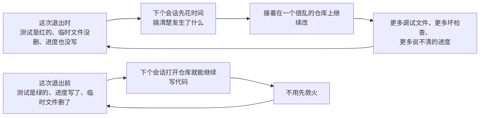

干净的交接流程如下

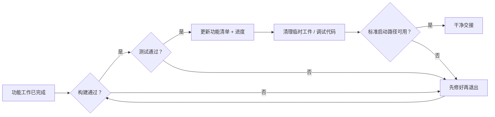

## 如何解决

### 1. 清洁状态是完成的必要条件

在 harness 里明确定义：**会话完成 = 任务通过验证 AND 清洁状态检查通过。** 缺任何一个，会话不算完成。在 CLAUDE.md 里写：

```
## 会话退出检查清单
- [ ] 构建通过 (npm run build)
- [ ] 所有测试通过 (npm test)
- [ ] 功能清单已更新
- [ ] 无调试代码残留 (console.log, debugger, TODO)
- [ ] 标准启动路径可用 (npm run dev)
```

### 2. 双模式清理策略

结合两种清理模式：

**即时清理（每个会话结束时）**：清理本次会话创建的临时工件、更新功能清单状态、确保构建和测试通过。这是"引用计数式"清理——用完就清。就像吃完饭马上洗碗，不留到第二天。

**定期清理（每周一次）**：全系统扫描——处理累积的结构性问题、更新质量文档、运行基准测试检测漂移。这是"追踪式"清理——定期做一次大扫除。

### 3. 维护质量文档

质量文档是对每个模块持续评分的活跃工件——就像宿舍的卫生检查评分表：

```markdown
# 质量文档

## 用户认证模块 (质量: A)
- 验证通过: 是
- agent 可理解: 是
- 测试稳定性: 稳定
- 架构边界: 合规
- 代码规范: 遵循

## 支付模块 (质量: C)
- 验证通过: 部分（支付回调未测试）
- agent 可理解: 困难（逻辑分散在 3 个文件）
- 测试稳定性: 不稳定（2 个 flaky 测试）
- 架构边界: 有违规
- 代码规范: 部分遵循
```

新会话读这个文档就知道优先处理哪里。质量评分最低的模块先修。就像卫生检查表上标记了"需要重点打扫的区域"——下一个值日生知道重点在哪里。

### 4. 定期简化 harness

harness 里的每个组件之所以存在，是因为模型无法独立做好某件事。但随着模型改进，这些假设会过时。就像你大一的时候需要学长带着选课，到了大三你自己就知道怎么选了——学长的作用变小了，但有些事情你还是需要问。

Anthropic 的实验直接展示了这一点。他们最初的 harness 包含 sprint 拆分机制——把工作分成小块让 Sonnet 4.5 逐个完成。当 Opus 4.6 发布后，模型的原生能力已经可以自主处理工作分解，sprint 构造变成了不必要的开销。移除后，builder agent 能连续工作超过两小时而不会跑偏，反而更流畅。

但 evaluator 的情况不同。即使 Opus 4.6 能力更强，在任务接近模型能力边界时，evaluator 仍然提供了实际价值——捕获 generator 的遗漏功能和存根实现。这意味着 evaluator 不是一个固定的是/否决策，而是取决于任务难度相对于模型能力的位置。

**推荐做法**：每月挑一个 harness 组件，暂时禁用它，跑基准任务。如果结果没退化，永久移除。如果退化了，恢复或用更轻量的替代。就像定期检查宿舍公约——大四了还在执行"每天 10 点熄灯"就不太合理了。

一个更具体的原则：**随着模型改进，harness 的有趣组合不是变少了，而是移动了。** 以前必须解决的问题被模型能力覆盖了，但新的能力边界打开了以前不可能的 harness 设计。AI 工程师的工作是持续找到下一个有价值的组合。

### 5. 清理操作必须幂等

清理脚本要能安全地重复执行——就像打扫卫生，扫两遍比扫一遍更干净，但不会更脏：

```bash
# 幂等的清理操作
rm -f /tmp/debug-*.log  # -f 确保文件不存在时不报错
git checkout -- .env.local  # 恢复到已知状态
npm run test  # 验证清理未破坏功能
```

### 6. 高吞吐量改变了 merge 哲学

当 agent 的产出远超人类审查能力时，传统的 merge 哲学需要调整。OpenAI 团队的经验：在一个 agent 每天开 3.5 个 PR（且后来增加到更多）的环境里，最小化阻塞式 merge gate 是正确的。PR 应该短命。测试 flake 通常用后续运行解决，而不是无限期阻塞进度。在一个修正成本很低、等待成本很高的系统里，快速前进 + 快速修正是比缓慢确认更好的策略。

**注意**：这在低产出环境里是不负责任的。但在 agent 产出远超人类注意力的环境里，这往往是正确的权衡。关键判断标准：**修正一个 bug 的平均成本 vs 等待人类审查一个 PR 的平均成本。** 前者低于后者时，快速合并是对的。
