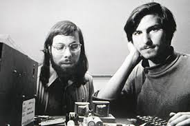

# 营销

马库拉在一页纸上写下了一篇名为《苹果营销哲学》的文章，强调了营销的三个要点：

第一点是“共鸣”，就是要设身处地为用户着想。“我们会比其他任何企业都更加充分地了解用户需求。

第二点是“专注”，“为了出色完成既定目标，我们必须心无旁骛，放弃所有无关紧要的心思和追求。

第三点同样重要，叫作“灌输”，其中心思想是人们对一个公司或产品的印象基于其对外传递的信号。

# 做事原则

乔布斯从他父亲身上学到了重要的一课：对工艺充满激情的标志就是，即使别人看不见的细节也要做得工整漂亮。

如果有些东西没做对，你不能视而不见、放任不管，想着以后再来处理。那是其他公司的做法，不是苹果的做法。

我们追求极致简约，希望产品能跟现代艺术博物馆的展品相媲美。我们整个公司的运营方式、产品设计、广告营销等方方面面的理念都可以用一句话概括：“追求极致的简约。而这一苹果奉行始终的设计理念在公司的首个宣传册上则被归结为：“至繁归于至简“。乔布斯认为，简约的设计是为产品服务的，目标是让产品更加好用。

乔布斯的反应一如既往：“我希望设计能尽可能完美，即使是装在盒子里，没人看到。就好比好的木匠不会用烂木头做橱柜的背板。”

乔布斯认为，要打造一台真正伟大的电脑，硬件和软件必须紧密相连、相互依存，变成不可分割的整体。如果电脑要兼容一些可以在其他电脑上运行的软件，必然要牺牲一定的功能。

他的一个核心原则就是硬件和软件应该紧密集成。他喜欢控制自己生活的方方面面，而就电脑而言，唯一的控制方式就是确保硬件和软件的一体性，全流程、全方位地对用户体验负责。

乔布斯的一个过人之处是知道如何聚焦。他说：“决定‘不做什么’跟决定‘做什么’同样重要。对公司来说是这样，对产品来说亦是如此。”

产品审查环节暴露了苹果严重失焦的问题。在官僚作风的驱使下，公司为了满足各类零售商的奇思怪想，每款产品都制作了多个版本。

从在第一本苹果手册里宣称“至繁归于至简”以来，乔布斯一直致力于追求达到“至简”的目标，而追求“至简”不是忽视事物的复杂性，而是认识和征服复杂性。

随着年龄的增长，我愈发懂得了“动机”的重要性。Zune之所以如此失败，是因为微软的人并不像我们那样真正热爱音乐乃至艺术。我们能赢，因为我们是发自内心地热爱音乐。我们是在为自己设计iPod，为自己或最好的朋友或家人做事的时候，就不会敷衍塞责。如果不是真正地热爱，就不会多付出一分心力，不愿意多花一个周末加班，也不会拼尽全力挑战现状。

# 产品设计

为什么我们认为简单就是美？因为就产品实体而言，我们必须获得掌控感。只要在复杂中建立秩序，就可以找到方法使产品听令于你。简约不仅仅是一种视觉风格或形式上的极简主义，也不仅仅是摒弃杂乱、去繁就简后的状态。简约是对复杂事物的精髓进行深度挖掘和精准提炼的结果。要做到真正的简约，就必须做到真正的深入。例如，如果为了达到看不到一颗螺丝的目标，结果却做出一个极为烦琐的产品，反倒违背了初心。更好的方法是深入“简约”的核心，了解与之有关的一切，了解简约的产品是如何生产出来的。只有深入了解一个产品的本质和精髓，才能真正做到去芜存菁。

设计不仅仅关乎产品的外观，还必须反映产品的本质和精髓。

设计是所有人造制品的灵魂，最终会通过一层层的外表展现出来。

我们一次又一次的问自己那些最根本的问题：“我们需要那个零件吗？我们能让这个零件整合其他4个零件的功能吗？”

在大多数其他公司里，通常是工程技术主导产品设计。先是工程师提出产品的规格和需求，然后设计师据此设计出可以把所有零件装进去的机箱和机壳。但对乔布斯来说，这个流程往往是反过来的。在苹果创业的早期，乔布斯先是批准了Mac的外壳设计，然后再要求工程师想办法把主板和元件全部装进外壳。

天赋慧眼的乔布斯一下就发现市场上满是二流产品。他仔细研究了当时市面上所有的音乐播放软件，像Real Jukebox，WindenmMedia Player，还有惠普CD刻录机里内置的软件，得出结论：“这些软件服计得太复杂了，就算是天才，也只能搞清楚其中的一半功能”。

他最主要的要求就是“简化”。他会仔细审查用户界面的每一个页面，逐一进行严格测试：如果他想找到一首歌或一个功能，按按键不能超过三次，而且这些操作要很直观。如果搞不清楚如何跳转到某个界面，或者需要按三次以上，他就会毫不留情地把人痛批一顿。法德尔说：“有时候，我们真的是绞尽脑汁也想不出怎么解决一个用户界面问题，而他就会说：“你们想到这个了吗？＇然后我们都会说：“天哪，还真没想到。＇他可以从完全不同的角度定义问题，寻求解决方法，我们的小问题就会因此迎刃而解。”

是选择封闭，还是选择开放？或者用乔布斯的话来说，是要整合，还是要分裂？苹果认为，应该把硬件、软件和内容处理捆绑成一个整洁的系统，这样才能确保简约流畅的用户体验，这一理念也充分体现了乔布斯天生的控制欲和完美主义

“允许Flash在不同平台之间移植，就意味着把整体水平搞垮。我们投入大量的时间和精力，不断完善苹果的平台，如果Adobe只能跟每个平台都有的功能兼容，那么开发者就无法享受苹果平台的任何优势。所以我们说，我们希望开发者利用我们的特色，这样他们在我们平台的应用程序上会比在其他任何人的平台上都运行得更好。

# 组织管理

乔布斯后来解释说：“我从这么多年的经验中学到，当与真正优秀的人才共事时，不必娇惯他们。只要对他们寄予厚望，鞭策他们去成就伟大的事情，他们就能不负所望。最初的Mac团队告诉我，顶级人才喜欢跟顶级人才一起工作，如果你能够容忍平庸的作品，他们反而不喜欢”。

“如果只能用救生艇带100个人去创建你的下一家公司，你会带谁？”

事实上，索尼给苹果提供了一个生动的反面教材。索尼的消费电子部门研发出了许多时尚精美的产品，而音乐部门也有很多深受喜爱的艺人（包括鲍勃·迪伦），但是每个部门都竭力保护自己的利益，公司缺乏团结一致的整体战斗力，无法打造端到端的集成服务。

# 科学与艺术

问题的核心在于热爱科技和热爱艺术的人之间存在鸿沟。而乔布斯已经在皮克斯和苹果证明，他既痴迷科技，又热爱艺术，由他搭建一座跨越鸿沟的桥梁再合适不过了。

他后来说：我是到了皮克斯才逐渐意识到，科技领域和艺术领域之间存在巨大的鸿沟。科技公司不理解艺术创意，无法欣赏直觉思维。音乐公司的经纪部门就不一样了，他们听了100个艺人的作品后，就能凭感觉判断出哪5个最可能成功。科技人员认为创意人员只是整天坐在沙发上，自由散漫，那是因为他们没有看到过像皮克斯这种地方的创意人士是多么动力十足、训练有素。

反过来说，音乐公司对科技也一无所知。他们认为去外面聘几个技术人员就行了。但这就像苹果去找人做音乐一样，我们找到的肯定是二流的经纪团队，而音乐公司也只能找来二流的技术人员。我清楚地知道，要打造科技产品，需要直觉和创意；而要搞艺术创作，也需要专业性和纪律性。事实上，只有少数几个人真正明白这个道理。

# 乔布斯的遗言

以下乔布斯的遗言（部分）：

有人会说，“顾客想要什么，就提供什么”。但这不是我的做法。我们的工作就是赶在顾客之前，替他们想清楚他们想要什么。

苹果之所以能引起人们的共鸣，是因为我们的创新中，蕴含着深刻的人文精神。

我讨厌追求一夜暴富的人以“企业家”自居。他们真实的想法就是在创业后找机会把公司卖掉或上市，借机捞上一笔。他们不愿意耗费心血建立一个真正的公司，而这才是做企业最难的环节。

