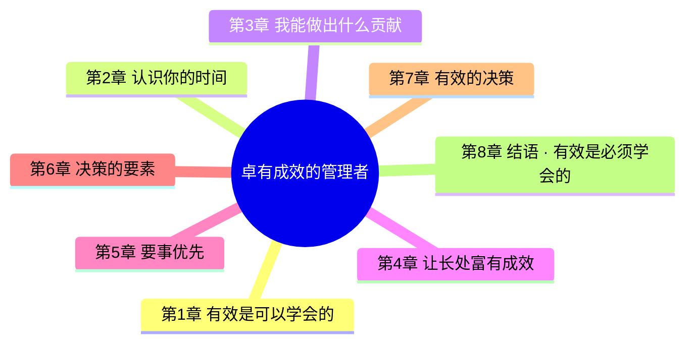
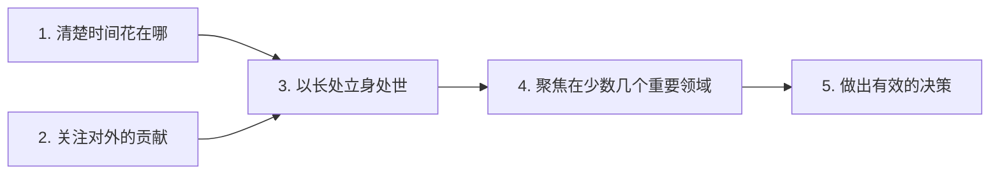
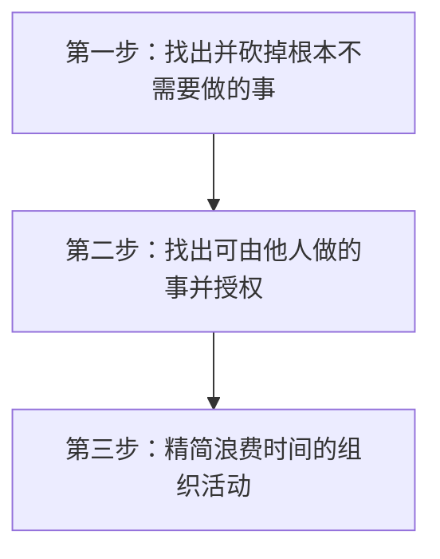

> 对有效管理有了更深的认识：**先有效管理自己，再有效管理他人**。
> —— 2026-09-29 读后点评

## 目录

- [全书思维导图](#全书思维导图)
- [推荐序 · 德鲁克给我的十条教谕](#推荐序--德鲁克给我的十条教谕)
- [前言 · 有效可以学会，也必须学会](#前言--有效可以学会也必须学会)
- [引言 · 有效管理者的八个惯常做法](#引言--有效管理者的八个惯常做法)
- [第1章 · 有效是可以学会的](#第1章--有效是可以学会的)
- [第2章 · 认识你的时间](#第2章--认识你的时间)
- [第3章 · 我能做出什么贡献](#第3章--我能做出什么贡献)
- [第4章 · 让长处富有成效](#第4章--让长处富有成效)
- [第5章 · 要事优先](#第5章--要事优先)
- [第6章 · 决策的要素](#第6章--决策的要素)
- [第7章 · 有效的决策](#第7章--有效的决策)
- [第8章 · 结语 · 有效是必须学会的](#第8章--结语--有效是必须学会的)
- [跋 · 不要告诉我这次见面很愉快](#跋--不要告诉我这次见面很愉快)
- [读后感 · 三条共鸣最深的原则](#读后感--三条共鸣最深的原则)

## 全书思维导图

## 推荐序 · 德鲁克给我的十条教谕

1. **谁是管理者** —— 任何一个需要对做好正确的事负责任的人，也就是任何一个尽力扑在少数几个影响最重大的优先任务上面的人，都是管理者（executive）。
2. **从自己做起** —— 领导者绩效与团队成员绩效之间的比值是固定不变的，因此如果你想提高大家的平均绩效，那么首先必须提高自己的绩效。
3. **扬长** —— 你的首要责任是找到自己独特的能力，找到你做得特别好的事、你最擅长做的事，理顺自己的生活与事业。做自己最擅长的事，但要精益求精；消除短处，但只针对妨碍长处得到发挥的那些短处。
4. **整块时间用于个人思考** —— 安排在思维最清楚的时段，每段可能只有 90 分钟，但再忙的管理者也应该定期思考。

> 💭 **个人思考**："忙碌是思考的天敌"。如果把每一分每一秒都用来处理事务，虽说勤勉，但是无法有效地思考，无法有效地反思宏观和微观层面的事。

5. **高效开会** —— 带着清晰的目的（"我们为什么开这个会？"）做准备以及严格跟进。那些能够充分发挥会议作用的人，花在会议准备上的时间会远多于实际开会的时间。

> 💭 **个人思考**：带着目的去参会。如果自己是发起人或者主要参与人，尽量多花些时间准备，提高会议效率。

6. **找到一件大事** —— 找到对未来贡献最大的一件大事，然后调集各方的努力去做。如果你能做出一项独特的贡献，也就是做出一个没有你的领导就不会产生的重大决策（哪怕无人认可你所起的推动作用），那你就提供了出色的服务。

> 💭 **个人思考**：这样才能凸显你的稀缺性，杜绝只接受安排型任务；个人也可以主动思考如何做更高影响力的事。

7. **敢于放下** —— 针对你已经在做的某件事（进军一项业务、聘用一个人、制定一项政策、开始一个项目等），假如现在让你重新决定要不要去做，你会启动吗？如果你的回答是不会，那为什么还要死守着不放？

8. **不是成功，是有用** —— "你看起来在怎么取得成功这个问题上花费了大量精力，但那是一个错误的问题⋯⋯正确的问题是，怎么才能有用！"

> 💭 **个人思考**：不要沉醉于自己成功做完了什么事，要思考这件事对周围有什么用——没有用则纯属自嗨。

## 前言 · 有效可以学会，也必须学会

"天生"有效的管理者，我一个也没有见过。所有做到了有效的管理者，一定是学而有之，而且必须持续练习，直到成为习惯。

> 有效性是管理者获得报酬的原因。他们付出的聪明才智再多，花费的时间再多，如果有效性为零，"绩效"就为零。

## 🔥引言 · 有效管理者的八个惯常做法

| # | 惯常做法 | 说明 |
|---|---|---|
| 1 | 问"什么事是必须做的？" | 韦尔奇每 5 年思考一次这个问题，每次确立的优先任务都是新的 |
| 2 | 问"什么事对企业来说是正确的？" | 凡是对企业来说不正确的决策，对其他利益相关者来说也都不会是正确的 |
| 3 | 制订行动计划 | 没有行动计划，管理者就会成为事件的囚徒；不设置检查点，就无从判断哪些事件是真正重要的，哪些不过是噪声 |
| 4 | 承担决策责任 | 聪明的管理者会避免在不擅长的领域做决策，而是交给别人去做 —— 世上不存在全能型天才管理者 |
| 5 | 承担沟通责任 | 优秀的管理者专注于机会而不是问题；更聪明的做法是月报第一页列举机会，第二页再列举问题 |
| 6 | 专注于机会而不是问题 | 解决问题充其量是防止损失；只有利用好机会，才能产生成果 |
| 7 | 召开富有成效的会议 | 会议必须精心管理；信马由缰不仅让人生厌，更会带来危险 |
| 8 | 思考并说"我们"，而不是"我" | （贯穿全书的立场） |

上述表格已经将“有效”的做法标记出来，本书剩余是做具体的阐述。

### 关于会议

管理者的会议类型应当分清 —— 宣布事项、听取单人报告、听取多人报告、向召集人汇报，各有不同规则：

- 宣布事项的会议，内容应当仅限于宣布的事项以及对此展开的讨论。
- 听取多人报告的会议，应当把报告早早分发给所有参会人，每个报告限制在预定时间之内（如 15 分钟）。
- 向召集人汇报的会议：管理者倾听并提问，听完之后做总结，但不要自己再讲一大通。
- 仅仅是"见面"性质的早餐会晚餐会，做不到富有成效。

> 👉优秀的管理者不会新提讨论事项，而是做完总结就宣布散会。任何一个会议如果不是富有成效的，就是纯粹浪费时间。

## 第1章 · 有效是可以学会的

### 五大要素

- 有效管理者**清楚自己的时间花在哪**
- 有效管理者**关注对外的贡献**
- 有效管理者**以长处立身处世**
- 有效管理者**聚焦在少数几个重要领域**
- 有效管理者会**做出有效的决策**——需要的是正确的战略，而不是眼花缭乱的战术

### 为什么需要有效管理者

- 我们对体力劳动只讲**效率**（efficiency），关注的是"正确地做事"的能力；**对知识工作者，生产率就是"做好正确的事"**。

> 💭 **个人思考**："正确的事"关乎的是方向和路线。怎么定义正确呢？对你所在组织有益的事就是正确的事。所以当你想变成有效的人，除了关注正确的方式方法，更需要关注你是否在正确的方向上。

- 学校里学习使用知识、理论和概念而不是体力的人，大部分会进入组织供职，只有能对组织做出贡献，才称得上是有效的。
- 工作缺少有效性，工作热情和对贡献的热望很快就会消退，变成一个朝九晚五混日子的人。

### 谁是管理者

- 知识工作者是否属于管理者，**并不取决于他是否管人**。

> 💭 **个人思考**：先管理自己，做到有效。

- 现代组织当中的每一位知识工作者都是"管理者"，前提是他由于担任职务或拥有知识，**需要承担做出贡献的责任，从而实质性地影响所在组织取得绩效和成果的能力**。
- **知识工作不能用数量去定义，也不能用成本去定义，只能用成果去定义。**
- 无论在工商企业还是政府机构，最基层的经理也会做一些跟最高负责人一样的工作：都涉及计划、组织、整合、激励和衡量。

### 管理者面对的现实

管理者要面对四个让其很难做到有效的现实：

1. **管理者的时间通常属于别人** —— 事情本身告诉管理者的信息极少，更不用说揭示真实的问题了。
2. **管理者需要一套标准去做真正重要的事**，而这套标准在事发顺序当中是找不到的。
3. **身处组织之中会把管理者推向无效** —— 只有自己的贡献被他人使用，一个人的工作才是有效的。管理者如果不去接触这些人，并且让自己的贡献对他们有效，他自己就无有效性可言。
4. **成果全部存在于组织外部**

> 💭 **个人思考**：对外部有用的才决定你是否有效，只对自己有用不行。决策者都在企业外部而非内部。

> 在外部世界中真正重要的事情不是趋势，而是**趋势的变化**。它们是决定组织及其努力成败的终极因素。

### 有效带来的希望

人类历史清晰地表明，**真正供应充足的只有各方面能力平平的人**。因此我们在组织中能用的顶多是在某一个方面表现出色的人，而这些人在其他方面可能连最起码的天赋也没有。我们不是要去努力培养全新的超人，而是不得不使用现有的人让组织运转起来。

> 💭 **个人思考**：全能超人是不存在的，学会用平凡的人做出不平凡的事。

## 第2章 · 认识你的时间

> 有效管理者与其他人最大的区别也许不是别的，就是他们对时间的珍惜。

### 管理者面对的时间需求

- 知识工作者必须专注于整个组织的成果和绩效目标，否则自己不可能取得任何成果或绩效。
- 要想取得有效性，每一位知识工作者，特别是每一位管理者，**必须有大块的时间可供利用**。如果可支配时间是支离破碎的，哪怕总时长非常可观，也是不足以成事的。
- 许多重大任用决策，都需要用大块的、不受打扰的时间去思考。
- **设备操作工的生活清闲，正是知识工作者工作时间更长的结果。** 管理者的时间短缺问题只会更加严重，而不是趋于缓和。
- 创新和变革对管理者的时间要求非常高，因为如果时间紧迫，人能想到的只有可能是自己熟悉的东西，能做到的也只有可能是自己常做的事情。

### 时间诊断 —— 三项连环修炼

**第一步 —— 找出并砍掉那些根本不需要做的事**

问自己："我时间记录表上的哪些活动，是别人同样可以做好，甚至做得更好的？"

**第二步 —— 授权**

> 要把别人能做的事全都分出去。授权不意味着某人应该分担一部分"工作"，而是"食其薪，就该谋其职"。

**我的解读**：授权不是简单的分活，需要自己去做才能做好的再去做，别人同样能做好就不需要自己也去做，节省时间。

**第三步 —— 精简浪费时间的组织活动**

有效管理者懂得系统而又诚恳地问："我做的哪些事，对你的有效性没有贡献，所以是浪费你时间的？"提出这个问题，而且不惧真相，这是有效管理者的一个标志。

### 精简浪费时间的活动 —— 三类组织缺陷

| 缺陷类型 | 典型表现 | 处方 |
|---|---|---|
| **缺少体系/远见** | 反复出现的"危机"，年复一年 | 同样的危机反复发生是疏忽和懒散的表现；管理良好的组织是"无趣"的组织 |
| **人员冗余** | 人太多导致相互挤压，需要不停解释 | 只有在主要工作中每天都用得上的知识和技能才在团队里常备；偶尔需要的专家应放在团队之外 |
| **会议泛滥** | 开会时间占 1/4 以上 | 一个人人总在开会的组织，便是一个无人做事的组织；会议太多说明职位结构和部门设计不合理、责任分散、信息没有送达实际需要的人 |

### 集中"可自由支配的时间"

- 高层管理者自己真正可以支配、用于处理那些真正有助于做出贡献和属于本职工作的事情的时间，**极少超过其工作时间的 1/4**。
- 有效管理者都会持续管理自己的时间：连续记录、定期分析、根据可支配时间的判断为重要事项设定期限。
- 两张清单——**一张写紧急事项，一张写虽然让人不愉快但又不得不去做的事项**，事项后面都写着期限。

> **时间是最稀缺的资源，不管好它，也就管不好任何其他事情。** "认识你自己"难到几乎无法做到，但任何人只要愿意，都可以遵循"认识你的时间"这个法则，踏上通往贡献和有效性的大道。

## 第3章 · 我能做出什么贡献

> **我的批注**：目标导向，以终为始。

有效管理者专注于贡献。他会从工作当中抬起头来，往外看向目标。他思考的问题是："我能做出哪些对我供职的这个机构的绩效和成果产生重大影响的贡献？"他看重的是责任。

- 一个眼里只有工作本身、看重下向权力的人，无论职位有多高，也只是一个"下属"。
- 一个重视贡献、对成果负责的人，无论职位有多低，都是名副其实的"高管"。

### 管理者自己的追求

- 追求贡献让管理者**超越自己的专业领域、自己有限的技能、自己的部门**，把注意力投向整个组织的绩效，投向组织的外部。
- 三类主要贡献：**①取得直接成果；②确立并不断强化价值；③培育和开发将来需要的人才**。
- 管理者不思考"我能做出什么贡献？"这个问题，不仅会把目标定得太低，而且可能把目标搞错，**会把自己的贡献定义得太窄**。

### 如何让专才有效

- **掌握知识的人始终应当承担起让他人理解的责任。** 认为门外汉有能力或者有责任去努力理解自己，或者自己只要跟少数同行专家交流就行了，那便是**傲慢到近乎野蛮**。
- **我的批注**：你应努力表达，别人没有义务一定要理解。只憋在肚子里面的知识是毫无用处的。
- 一个对自己应该做出的贡献负责的人，会努力把自己狭窄的专业领域融入整体。
- 不停地询问组织中的其他人："你需要我对你做出什么贡献，才能让你对组织做出你的贡献？你什么时候要，以什么方式要？"
  - 成本会计师问完后很快会发现：自己看来浅显易懂的假设，在使用会计数字的经理们看来很陌生；自己看来很重要的数字，生产运营的人根本不相关。
  - 制药公司的生物化学家问完后会发现：研究成果必须用临床医生习惯的语言表达，才会真正得到应用。

### 正确的人际关系

> **我的批注**：职场是个讲求个人价值和贡献的地方，做个人畜无害的小透明是不行的。哪怕你强势一点，但是对组织带来实实在在的贡献，也是可以被允许的。

- 管理者在组织内如果拥有良好的人际关系，原因**不在于拥有"人际天赋"，而在于他们都专注于贡献**。
- 相处融洽和言语和悦不仅没有意义，而且不过是恶劣态度的虚假门脸罢了——如果以工作和任务为中心的人际关系不能带来成就的话。
- **偶尔的疾言厉色并不会对人际关系造成伤害**——如果这种关系有助于各方取得成果和成绩的话。

### 专注贡献与自我发展

"我对组织绩效能做出的最重要的贡献是什么？"问这个问题的人，实质上是在问：

- 我需要什么样的自我发展？
- 我要做出应有的贡献，需要获得哪些知识和技能？
- 我需要在工作当中发挥哪些长处？
- 我需要给自己确立怎样的工作标准？

### 有效的会议

一个显而易见但又经常被人忽略的法则是角色要分明：**一个人可以主持会议并听取要点，也可以作为参会人展开讨论，但不可二者兼得**。

## 第4章 · 让长处富有成效

> 要想取得成果，必须使用所有人的长处，包括同事的长处、上级的长处、自己的长处。**众人的长处才是真正的机会所在**。让长处富有成效是组织的独特目的。

### 用人所长

- **世上没有"能人"这回事，"能在哪里"才是关键所在。**
- **我的批注**：深深赞同，发挥长处可以掩盖劣势。
- 人只有聚焦于一个领域，顶多是很有限的几个领域，才能达成卓越。
- 真正"严苛的上司"（但凡能成就人的上司都是严苛的），总是从思考一个人**应该能做好什么事**出发，然后要求这个人真正做到。
- 组织可以让人的短处只影响他自己，少影响甚至不影响他的工作和成绩。例如，一位不擅长人际的优秀税务会计师，可以安排独立办公室。
- 有效管理者对人的短处不会视而不见——知道某人精通税务会计，就让他专做这块，不会抱有幻想让他当经理。

### 让长处富有成效的四条铁律

1. **职位必须由任务决定** —— 不是由个性决定。
2. **创建一流管理者团队的人，往往不会跟直接同事和下属建立特别亲密的关系** —— 按照能力而不是喜好挑选人，追求绩效而不是顺从；有意跟工作关系紧密的同事保持距离。
3. **知识工作需要的不是这种或那种特定的技能，而是一个结构** —— 只有用绩效去检验才能揭示它是否合适。年轻人应当尽早思考："这个职业和这个地方适合发挥我的长处吗？"
4. **用人所长，就要能容人所短。**

### 关于"富有激情却又很快变成废柴"的年轻人

真正对工作充满热情并取得成果的，是那些**能力得到使用并受到挑战的人**。职位过于狭窄且能力没有受到挑战的那些年轻的知识工作者，不是选择离开，就是很快堕落为早衰的中年人，尖酸刻薄、玩世不恭、碌碌无为。

> 各个地方的管理者都在抱怨，很多激情似火的年轻人很快变成了燃尽的废柴，其实这些管理者自己才是罪魁祸首——因为他们把年轻人的职位设计得过于狭窄，浇灭了年轻人心中的热火。

### 唯一必须否决的短板：品格

下级通常会把有魄力的上级作为自己的榜样，因此**一个富有魄力但品德败坏的管理者，对于一个组织来说最容易造成品德败坏，也是最具破坏力的**。良好品格和正直本身并不足以成事，但缺少它们会搞砸一切。只有在这一个方面，只要存在短处就应当做出否决。

### 用人的铁律

> 职位出现空缺时，只提拔那个已经用绩效证明最适合这个职位的人。

所有违背这条原则的说辞——"这人少不了"、"这人不会得到接纳"、"这人太年轻"、"我们从不把没有现场经验的人安排到这里来"——都不应加以理会。**用人时着眼于抓住机会，而不是解决问题**，既有益于创建最有效的组织，也有益于激发热情和奉献精神。

反之，管理者有责任坚决调离任何一个总是不能取得出色绩效的人，特别是这样的经理。姑息这种人留任，会伤害其他人、伤害组织、伤害其下级、对当事人自己更是毫无意义的折磨。

### 马歇尔将军的启示

马歇尔将军总是在问**"这个人可以做好什么事？"**，一旦发现某人确有长处，此人的短处就是次要的了。他还明白，**每一个任用决策其实都是赌博，但是基于人之所长去做决策，至少是在理性地赌博**。

> 上级不仅对下级的工作负有责任，而且手握影响下级前途的权力，因此让长处富有成效不仅是上级有效性的一个要件，更是上级的一项**道德义务**。

### 管理上级

- 如果上级得不到提拔，下级常无出头之日。
- **让上级的长处富有成效是下级自己取得有效性的关键所在。**
- 通过发挥上级的长处把他们的短处变得无关紧要——管理者要取得有效性，很少有什么事的作用大过发挥上级的长处。

## 第5章 · 要事优先

> **我的批注**：聚焦，做难而正确的事情。

管理者越是努力让长处富有成效，就越清楚有必要把所有可用的长处聚焦于抓住重要机会。这是取得成果的唯一途径。

**每次只做一件事，出自如下几个原因：**

- 很多一件事也没做好的人，反而要费力得多——他们低估了任何一项任务所需要的时间，设想诸事顺利，但现实**意外频发**。
- **我的批注**：不能过分乐观，给予每件事适当缓冲。

> 把自己的和所在组织的时间和精力聚焦起来，每次只做一件事，而且总是要事优先。

### 抛弃昨天

- 有效管理者会定期检视自己和同事的工作计划："**假如这件事不是已经在做，现在还会去做吗？**"除非答案是无条件的"是的"，否则停止或大幅减少投入。
- 人们认为所有计划都应该持续开展下去，除非事实证明它们已经不再有用；**正确的做法是假设所有计划都很快会过时，除非事实证明它们确有成效且有必要继续开展**。
- 一个组织有必要经常引入新鲜血液，吸纳新观点。但**不要把新人引入风险极高的地方**（最高管理团队和重要新任务的负责人职位）——可以让他们担任略低于最高层的职位，或者负责已经定义清晰、有章可循的活动。
- **系统地抛弃过去，是建设未来的唯一途径。** 任何一个组织都不缺少构想，问题不在于没有"创造力"，而在于很少有组织真正着手去实现它们这些好的构想，所有的人都在忙旧任务。
- 杜邦公司比世界上其他任何一家化工巨头都要出色得多，在很大程度上就是因为该公司**总是在产品或工艺走下坡路之前就将其淘汰**。

### 优先任务与延迟任务

之所以很少有管理者能够做到聚焦，原因在于很难设置"延迟任务"——也就是决定哪些事情不去做，并严守这个决定。

**确定优先任务的几条原则：**

- **重视将来，而不是重视过去**
- **专注于机会，而不是专注于问题**
- **选择自己的方向，而不是随波逐流**
- **目标高远，做可以带来不同的事；而不是但求"安全"，做容易的事**

> 聚焦就是有勇气对什么是真正重要和优先的事项做出自己的决策，并据此使用自己的时间。**它是管理者成为时间和任务的主人，而不受其驱使的唯一希望。**
>
> **我的批注**：要能断舍离，很难但是时间是有限的。

## 第6章 · 决策的要素

### 两个决策案例

**贝尔实验室** —— 时至今日，抱着商业思维的人很少会明白：研究要想富有成效，就必须成为"破坏者"，与今天为敌，创造不一样的明天。在大多数研究实验室，盛行的是"防御性研究"，目的是延续今天，而贝尔实验室从成立的第一天起就摒弃了这种研究。
**我的批注**：机会比目前具体工作内容更重要。

**韦尔与 AT&T** —— 韦尔设计的 AT&T 普通股的股息近似于有担保，这使得它非常类似于固定收益债券；"萨莉大婶"式的投资者群体还没真正形成时，韦尔把这些中产阶级的钱变成 AT&T 的投资者，光凭这一招就让公司筹集了数千亿美元。

与高超技巧相反，这些伟大决策人**都是在概念性理解的最高层面去解决问题**，决策之前都是先弄清问题的本质，再努力提出决策的指导原则。

### 决策过程的五个要素

#### 1. 这是共性问题，还是特例？

- 除了真正的特例之外，所有事件都需要共性解决方案——**确立规则、政策和原则**。
- 最常见的错误是把共性问题当作一连串的特例对待——既无共性的理解，又未确立处理原则，只好搞实用主义。这必然导致挫败和徒劳。
- 有效决策者总是努力在尽可能高的概念层面上寻找解决方案。
- 肯尼迪内阁的失败正源于此——他们奉行"实用主义"，排斥制定规则和原则，坚持"量体裁衣"处理一切事务。
- **"如果我必须伴随它生活很长时间，我还愿意吗？"** 如果答案是否定的，就继续思考，寻找更高概念层面的、可以建立正确原则的解决方案。

#### 2. 定义边界条件

- 决策要达到什么目的？最低目标是什么？要满足哪些条件？
- **边界条件定义得越准确、越清晰，决策有效和达到最初目的的可能性就越大。**
- **最危险的决策，是假如一切都不出差错才有可能奏效的决策。** 这样的决策总是看似正确，但只要仔细考虑必须满足的多项参数，就会发现不同参数在本质上互不兼容。**这不叫决策，而是在祈祷奇迹发生。**

#### 3. 先想什么是"正确的"，再谈妥协

决策如果是从"什么是可以被人接受的？"这个问题出发，结果只会一无所获——在回答的过程当中，人们通常会放弃那些重要的东西，于是丧失了做出正确回答的机会。

#### 4. 把行动融进决策

- 这个决策，谁必须知情？哪些行动是必须采取的？谁负责行动？行动必须是什么样的，才能让负责的人能够施行？
- **如果把决策转化为有效的行动还需要相关人员改变行为、习惯或者态度，这一点就尤其重要。**
- 决策者还必须确保衡量手段、绩效标准和激励措施同步做出改变——否则，人们就会陷入内心的挣扎，行动乏力。
- 韦尔把服务确立为贝尔公司的业务之后，**如果不是因为他把服务绩效确立为管理者绩效的衡量标准，这个决策就会成为一纸空文**。

#### 5. 建立反馈机制

- **走出去亲自做调查**，可能是对决策所依据的假设加以检验的最好的方法，甚至是唯一的方法。
- 假设迟早会过时，现实不会长时间静止不变。
- 有一些做法明明已经不合时宜，却还继续存在——原因通常是决策者没有走出去亲自调查。
- 一些政府/企业失败的原因都可以追溯到这一条：决策者没有去现场，**沦为教条主义者**。

## 第7章 · 有效的决策

> 决策就是判断，是在不同备选方案之间做出选择。选择很少发生在对错之间，顶多是发生在"大致对"和"可能错"之间，但更多的是发生在不知道哪一条对得更多一点的两条行动路径之间。

### 决策不是从事实开始的，而是从观点开始的

- 观点不过是未经检验的假设，**除非用现实加以检验，否则毫无价值**。
- 要确定什么是事实，先要确定**相关性标准**，特别是确定合适的**衡量标准**——这是有效决策的关键所在，通常也是最容易引起争议的地方。
- 有效的决策**并不像很多关于决策的文献所讲的那样，源于大家基于事实取得的共识**。

### 决策的第一条法则：无不同意见，就不做决策

- 凡是做判断，都必须从多个备选方案当中做出选择。**如果只能说"是"或"否"，那就算不上做判断。**
- 有效管理者鼓励大家提出观点，但也会坚定地要求提出观点的人把"试验"必须证明的东西想清楚。
- **只有考虑过多个备选方案，才有可能发现真正的风险有哪些。如果没有考虑过多个备选方案，那么决策者的思路一定是封闭的。**

### 罗斯福的"影子内阁"做法

每次遇到重大事项，罗斯福都会挑一个助手，对这个人说："我想要你去做这件事，但是要保密。"（他清楚这必定会让华盛顿立刻人人皆知。）然后他会另外找几个意见不同的人，安排同样的任务，同样要求"严格保密"。这样做的结果是：**每一件事的每一个重点都会得到深入的思考**，并向他报告，这样便有把握不至于被某个人的成见所束缚。

> 不同意见有助于把似是而非的东西变成正确的理解，再把正确的理解变成良好的决策。

### 行动 vs 不行动

- 有一种情况是：哪怕什么都不做，出现的问题也会自然消失——**"假如我们什么也不做，会发生什么事情？"答案如果是"它自己会解决的"，那就不要干预**。如果情况虽然让人厌烦，但它无关紧要或者不太可能造成什么后果，也不要干预。
- **如果收益远大于成本和风险，那就行动。**
- **不管是行动还是不行动，不要"骑墙"或者妥协。**
- **只要事情是正确的，那么艰难、不为人喜或令人恐惧，都不是不去做的理由。** —— 我的批注：做难而正确的事。
- 如果觉得内心不安却不知原因，那就要停下来再想一想，哪怕只是短暂地停一停。

## 第8章 · 结语 · 有效是必须学会的

### 让长处富有成效是根本

让长处富有成效从根本上讲是以行为表达出来的**态度**，是对人、包括对自己和对他人的**尊重**，是价值体系的体现。但它同样是"在干中学"和通过练习实现自我发展。管理者让长处富有成效，就能把**个人目的和组织需要、个人能力和组织成果、个人成就与组织机会**结合在一起。

### 五大支柱的呼应

- 第5章"要事优先"是对第2章"认识你的时间"的呼应——这两章可以说是管理者有效性的两大支柱，起着**限高和支撑**的作用。
- 记录和分析的对象不再是发生在我们身上的事，而是我们应当努力在环境当中促成的事。**发展的结果不再是信息，而是品格：远见、自立和勇气。**
- 换句话说，发展的是**领导力**——不是源自才华和天赋的领导力，而是朴实得多但会更加持久的，源自奉献、决心和庄严目标的领导力。

### 三个石匠

《大教堂的故事》：

> 第一个说："我在挣钱糊口。"
> 第二个边敲石头边回答："我在干全国最漂亮的石匠活儿。"
> 第三个抬起头来，眼里带着憧憬说道："**我在建造大教堂。**"
>
> 第三个石匠才是有望取得有效性的人。他专注的是外部，是贡献。

## 跋 · 不要告诉我这次见面很愉快

> 有效就是**"做好正确的事"**。

德鲁克每次结束咨询的时候都会说："**不要告诉我，这次见面很愉快，而是要告诉我，下周一你准备做哪些不同的事？**"

确定优先任务的关键在于确定**延迟任务**——你决定不去干的任务——才能明确无误地聚焦于少数几项优先任务：

- **重视将来**，而不是重视过去；
- **专注于机会**，而不是专注于问题；
- **选择自己的方向**，而不是随波逐流；
- **目标高远**，做可以带来不同的事，而不是但求"安全"，做容易的事。

我的批注：视野要大；一定要实际行动。

## 读后感 · 三条共鸣最深的原则

1. **有效 ≠ 高效**。效率是"把事情做对"，有效是"做对的事情"。知识工作者的价值，在于**最高概念层面上的判断和选择**，而不是把事情做得更漂亮。
2. **贡献在外部，不在内部**。先问"我的输出谁用得上？"再思考"我怎么做这个输出？""对外有效"的思维可以内化到日常——无论是写代码、写文档还是开会，最终坐标都应指向**接收方**。
3. **要事优先 + 抛弃昨天**。聚焦的真正难点不在于"决定做什么"，而在于"决定不做什么"。每次只做一件事、假设计划会过时、把机会排第一页、把问题排第二页——这是把有限时间真正用起来的唯一方式。

> ——"不要告诉我这次见面很愉快，而是要告诉我，下周一你准备做哪些不同的事。"
