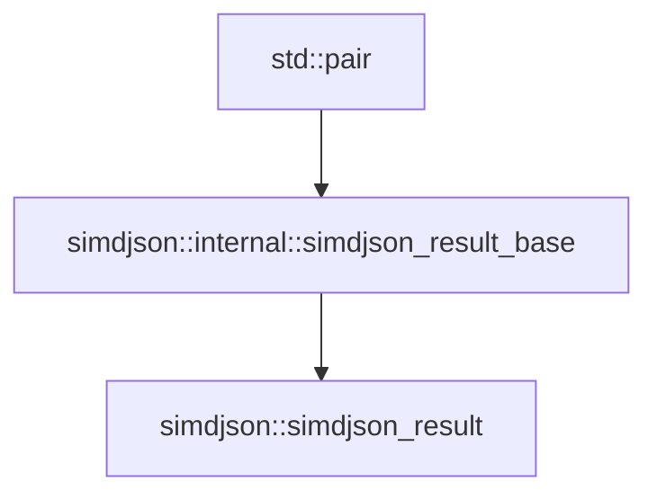

最近在进行C++的差错处理时，经常碰到如果函数内部发生异常或错误，返回结果该怎么设置的问题。最常见的办法是为可能出现的异常或错误，设置对应的返回数值，这样当调用者拿到结果时，检查返回值就可以知道函数工作是否正常了；另外一种办法可能就是为函数配备错误码，返回值放到函数中按照引用来标记，将错误作为返回值，调用者可以直接根据错误码就行判断。

在simdJson的错误处理中，我看到了另一种处理方法，就是将**输出数值**与**错误信息**绑定。




通过上面类层级，可知**simdjson::simdjson_result<t>**通过**std::pair<T,error_code>**将错误码与值绑定在一起。

```c++
simdjson_warn_unused simdjson_inline error_code     get (T &value) &&noexcept;

simdjson_inline error_code  error () const noexcept;

simdjson_inline T &  value () &noexcept(false);

simdjson_inline T &&  value () &&noexcept(false);

```

我们可以像上面API所示，方便的取出值和其绑定的错误码。另外，为了更加方便的使用，simdJson提供了如下API

```c++
simdjson_inline     operator T&& () &&noexcept(false);
```

这样，我们就可以直接在**simdjson::simdjson_result<T>**的对象上调用**T**的方法。


参考链接：

1. Rust option

2. [C++ and Beyond 2012: Andrei Alexandrescu - Systematic Error Handling in C++](https://www.youtube.com/watch?v=kaI4R0Ng4E8)

3. [What's the equivalent of Option and Result in C++?](https://www.reddit.com/r/rust/comments/2f5twr/whats_the_equivalent_of_option_and_result_in_c/?rdt=48674&onetap_auto=true)
