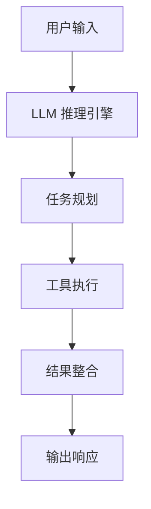
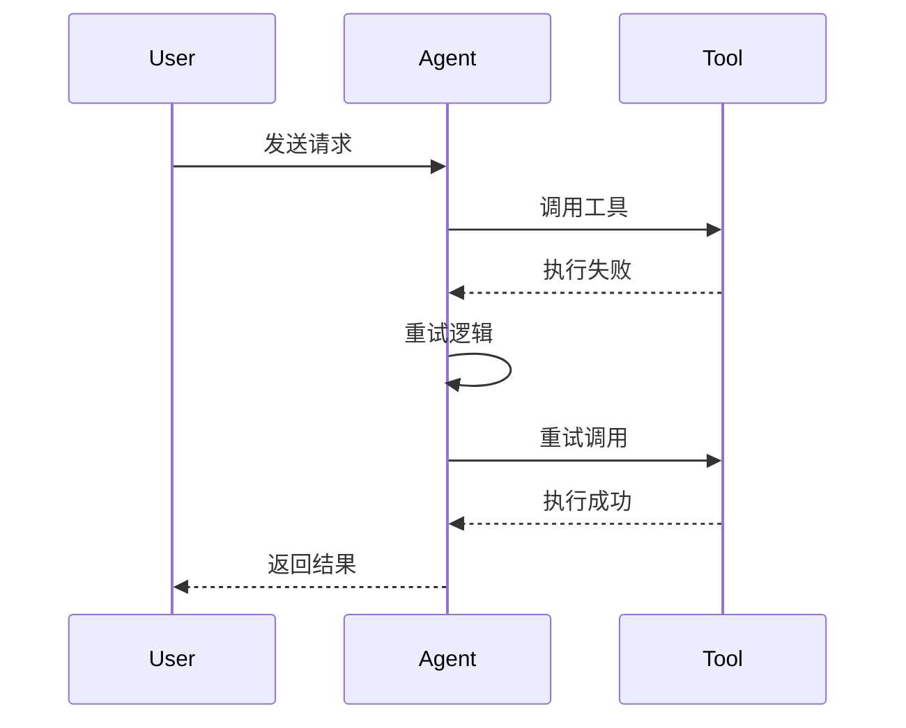

## 引言

在人工智能快速发展的今天，LLM Agent 作为一种能够自主执行任务的 AI 系统，正在改变我们开发和使用 AI 的方式。本文将分享我在 LLM Agent 开发过程中的实践经验，包括架构设计、开发流程和最佳实践。

## LLM Agent 的核心概念

### 什么是 LLM Agent？

LLM Agent 是一个能够理解用户指令、规划任务、执行操作并返回结果的 AI 系统。它通过结合大语言模型（LLM）的推理能力和各种工具的执行能力，实现复杂任务的自动化处理。

### 核心组件



## 开发流程

### 1. 需求分析
- 明确任务目标和范围
- 识别所需的工具和能力
- 定义成功标准

### 2. 架构设计
- 选择合适的 LLM 模型
- 设计工具接口
- 规划系统流程

### 3. 实现步骤
1. 环境搭建
2. 工具开发
3. 提示词工程
4. 系统集成
5. 测试验证

## 最佳实践

### 提示词工程

```python
SYSTEM_PROMPT = """你是一个专业的 AI 助手，具有以下能力：
1. 理解用户需求
2. 规划任务步骤
3. 执行具体操作
4. 提供清晰反馈

请按照以下步骤处理用户请求：
1. 分析需求
2. 制定计划
3. 执行操作
4. 总结结果
"""
```

### 错误处理



## 常见问题与解决方案

### 1. 响应延迟
- 使用异步处理
- 实现超时机制
- 优化提示词

### 2. 错误处理
- 实现重试机制
- 添加错误日志
- 提供用户反馈

### 3. 成本控制
- 优化 token 使用
- 实现缓存机制
- 监控使用情况

## 总结

LLM Agent 开发是一个复杂但充满挑战的过程。通过合理的架构设计、清晰的开发流程和严格的最佳实践，我们可以构建出高效可靠的 AI 系统。关键是要持续学习和改进，在实践中不断优化。

## 参考资料

- [LangChain 官方文档](https://python.langchain.com/docs/get_started/introduction)
- [OpenAI API 文档](https://platform.openai.com/docs/api-reference)
- [ReAct 论文](https://arxiv.org/abs/2210.03629)

<figure style="text-align: center">
    
    <figcaption style="font-style: italic; color: #666;">LLM Agent 系统架构图</figcaption>
</figure> 