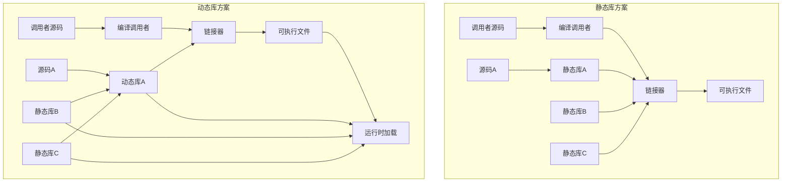

若调用者代码使用A库，A库依赖静态库B和静态库C，当A分别编译生成动态库和静态库时。从调用者角度，编译链接使用的流程如下：

```mermaid
flowchart TD
    subgraph static["静态库方案"]
        A1["源码A"]-->B1["静态库A"]
        C1["调用者源码"]-->D1["编译调用者"]
        D1-->E1["链接器"]
        B1-->E1
        F1["静态库B"]-->E1
        G1["静态库C"]-->E1
        E1-->H1["可执行文件"]
    end

    subgraph dynamic["动态库方案"]
        A2["源码A"]-->B2["动态库A"]
        F2["静态库B"]-->B2
        G2["静态库C"]-->B2
        C2["调用者源码"]-->D2["编译调用者"]
        D2-->E2["链接器"]
        B2-->E2
        E2-->H2["可执行文件"]
        H2-->I2["运行时加载"]
        B2-->I2
        F2-->I2
        G2-->I2
    end
```
